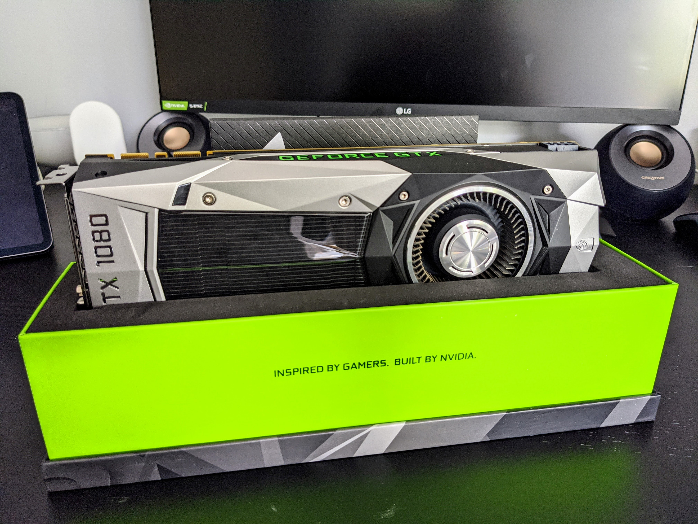
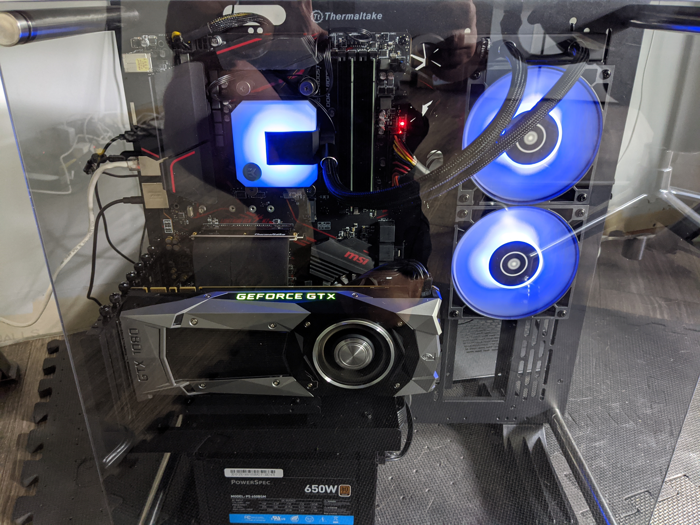

A few weeks back,[ I explained how my $900 gaming PC quickly became a $1,200 gaming PC](/n/articles/i-was-so-wrong-dont-build-your-own-pc/). Would you believe we're up to $1,500 now?

Yeah, I'm a sucker.

Although at $900, the original system was perfectly capable of playing the games I wanted to play, I made the mistake of watching some YouTube videos that wowed me: Sometimes will silly things like RGB lighting and sometimes with some performance boosts.

My latest silly decision falls into the latter category as I found an Nvidia GTX 1080 Founders Edition graphics card on eBay for $330.

To be sure, this is a great deal on paper, even if the card was launched in 2016. You can still find new ones for sale running between $500 and $700 or more. 

Still, I probably shouldn't have pulled the trigger, given that once Nvidia launches their next-gen cards, likely next month, this GTX 1080 will be two generations behind.

Even so, I'm happy with the purchase and given my open air case, it took all of 5 minutes to swap out the GTX 1660 card I bought in May for $200 and replace it with the "new" older graphics card.

After benchmarking between the two cards, I'm getting roughly 15 to 20 more frames per second on the GTX 1080. Essentially, I can either run my games with a faster frame rate on my 144fps monitor or I can keep the same frame rate (which isn't bad) but with more detailed, higher graphics settings.

I'll take it. Now... what's next for the gaming rig? ;)
