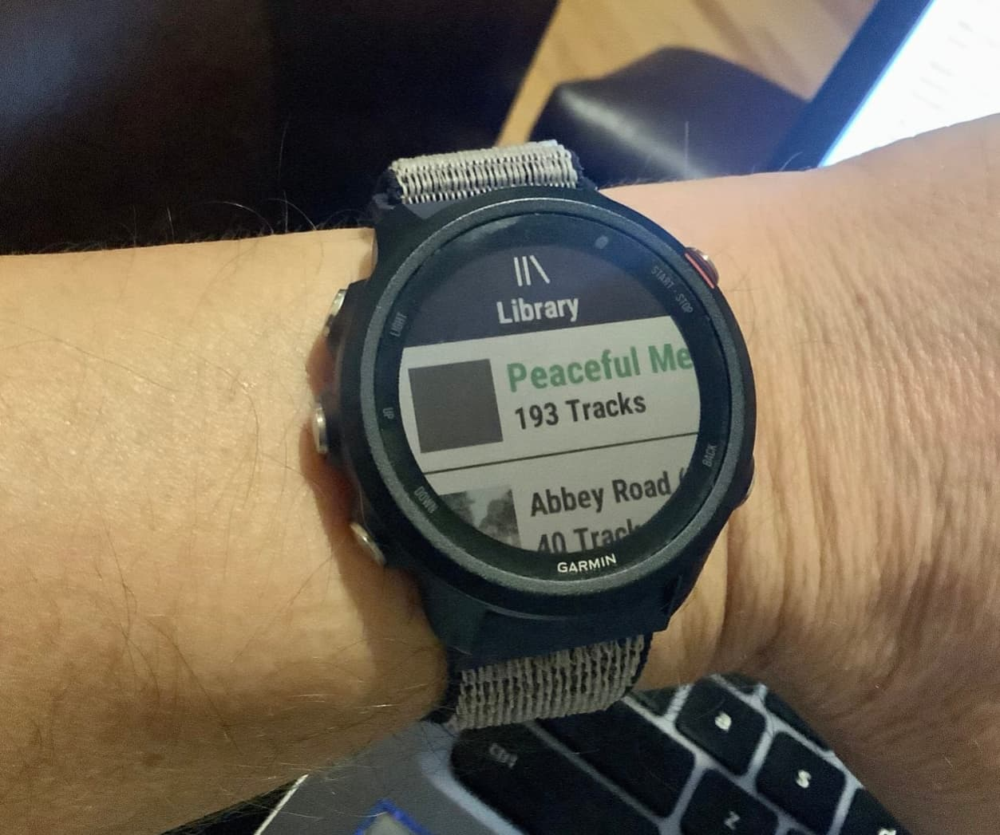
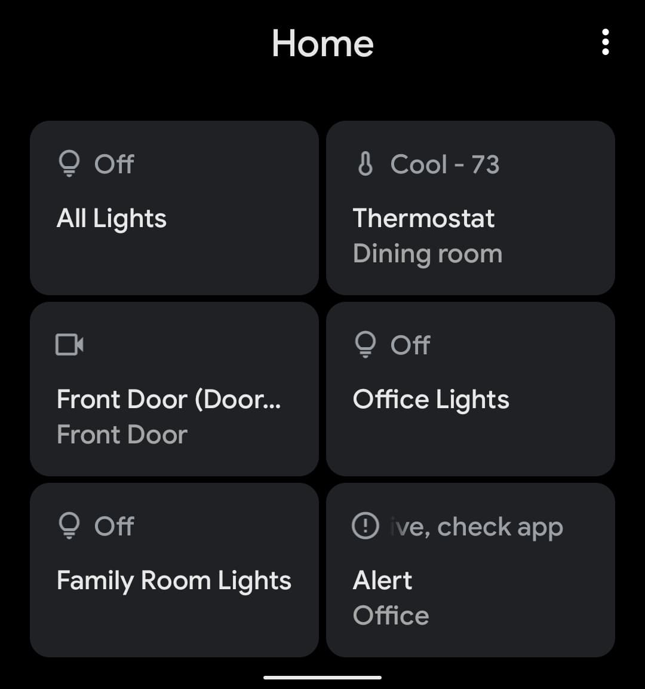

Earlier this month, I took the SIM card from my iPhone 11 Pro and dropped it in my Pixel 4. I have a Pixel 4 XL too, but it's a bit big for my small hands and pockets.

## Why do I do this?

As long as I've been covering mobile technology, since 2006, I've tried to maintain perspective by using just about every software platform there is. That means in addition to Android and iOS, I've extensively used Amazon FireOS, BlackBerry, PalmOS, Meego, Symbian and Windows Mobile / Windows Phone, to name a few.

My take is that you can't appreciate (or see gaps in) different devices and platforms unless you really live with them all. Thankfully for my wallet, it's really just a two-horse race now with Android and iOS.

## Over time, Android and iOS have become mostly the same

It's amazing how different Android and iOS were 10, maybe even 5 years ago. Sure, there were similarities here and there, but I'd argue that the two mobile operating systems are far more alike now than they are different.

I'm using the beta versions of Android 11 and iOS 14 to see that point. 

The gesture interfaces between the two are practically identical now. App management and home screens are extremely similar now that Apple will no longer require app icons on home screens. Widgets abound on both devices. You get the idea.

## It's easier than ever to switch (at least for me)

Although I've used most of the mobile platforms, one strategy I adopted early has served me well: Whenever possible, use apps and cloud services that aren't specifically tied to a single mobile OS.

That means I've long used Google apps and services across devices so that I can get at my data and do what I need to, regardless of the device in hand. I've never used Apple's productivity suite for this reason. Instead, it's been Google Docs for years, although I also use Microsoft's Office apps for school purposes. All of these are available and work well on both Android and iOS. Some Google apps work even better on iOS than they do on Android!

I was a Google Play Music user, then switched over to Apple Music, and finally landed on Spotify. 

Not only does it work on all of my mobile devices, but also all of my smart speakers at home as well as my current wearable (more on that in a sec), which supports Spotify music downloads for offline playback.

## What do I miss from iOS?

Not much, actually. 

iMessages is nice but doesn't offer much more than I need from standard SMS messaging on Android these days. I can live with the "green bubble" stigma as well. ;)

Apple HomeKit support is iOS-only, but again, in my smart home, I went for cross-platform solutions such as Amazon Alexa, Google Home and Samsung SmartThings. If I had created a HomeKit home, I'd literally have to stick with iOS due to platform lock-in.

I do miss using my Apple Watch 3 with LTE but I've replaced it with less functional Garmin Forerunner 245. There's no LTE, of course, so I can't leave my phone behind like I used to. I'll live. 

## What do I really like about Android these days?

For starters, the new Home controls shown when holding down the power button of the phone are great. No need to go into the Google Home app or (when I need to be quiet) speak a voice command to adjust lights or some other device.

The Google Messages app has been slowly maturing with RCS, or Rich Chat Services, to become more on par with iMessages.

Every camera image (all of which are pretty stellar) are automatically uploaded to my Google One cloud storage account. I can do the same with iPhone but it's a manual process.

Android phones continue to be better integrated with my daily computing device, which is one of several Chromebooks.

## Final thoughts for now

I'm not suggesting that iPhone owners drop their phone and switch to Android. I've always said people should use the best tool that meets their needs. And the iPhone is obviously great for a large number of people in that regard. I get it.

But switching is easy, if you've set yourself up for as many cross-platform apps and services as possible. The two operating systems are more similar than different. And although there are some specific features or functions that iOS has, none of them have forced me to stick with an iPhone. Freedom is good!

