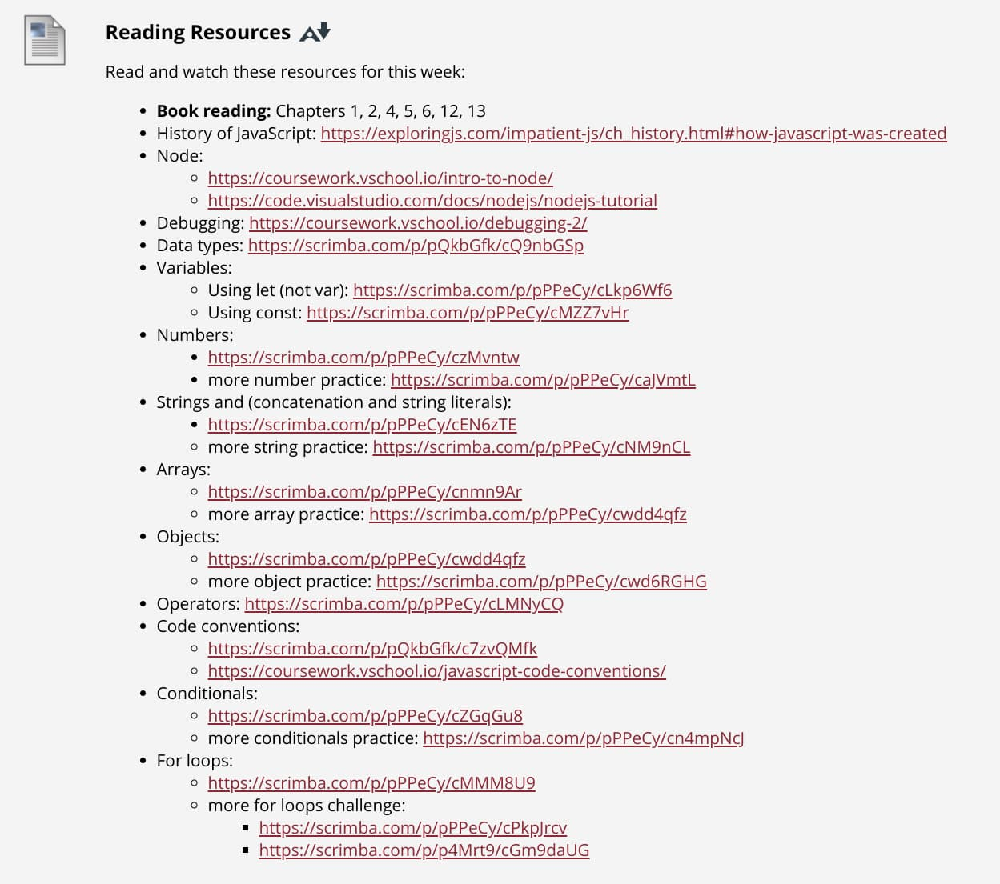

Up until three months ago, I'd never written a single line of JavaScript. I still haven't written much outside of a sample web app that shows cryptocoin pricing based on the user's choice of coin. 

Here's the demo app, below.

*Note that if it doesn't work the first time, clicking the Reset button and trying again should fix it. I'll have to figure out why it doesn't work on the first load; remember, I'm a JS n00b!*

<h3>JavaScript demo to show current value of crypto</h3>
  <form>
    <label form="coin">Choose a cryptocurrency:</label>
    <select id="coin" name="coins">
      <option value="BTC">Bitcoin</option>
      <option value="LTC">Litecoin</option>
      <option value="ETC">Etherium</option>
      <input type="button" value="Submit" onclick="printCoin()">
      <input type="reset" onclick="location.reload()">
    </select>
  </form>
  
Coin: 

  
Price:

 

But as I've read more about JavaScript, and seen how it can power this blog, my long term focus has changed.

Originally, I figured I'd take what I learned from my in-progress Computer Science program at the local community college and apply it to mobile development. Not any more. I'm thinking web development all the way for several reasons.

I think I'd rather not be tied to a specific app store or proprietary platform. Instead, the more accessible web seems to be the place for me. And while I could focus on HTML and CSS as a front-end developer, I'd prefer to create more functionality than presentation and content. 

I've been creating content online since 2003, so I've "been there and done that" more than enough: I wrote nearly 10,000 blog posts during my stint at Gigaom between 2008 and 2015, for example.

## Week 1

Anyway, class officially started this week but since my section is scheduled for Mondays and today is Labor Day, there's no official class. 

Instead, we were greeted with this list of readings and videos, along with a handful of relatively light questions and problems to show that we've got our development environment installed with Node.js, can output "Hello world" to the console and such.

If you look at the first line in the readings, you'll see why [I ordered my book for class two months ago and read through the first third of it in advance](/n/articles/added-to-the-to-do-list-a-jamstack-blog-commenting-system/). 

**\#ProTip to students: Do this when you can.**

I'm thrilled that we get the basics out of the way early on. You can see in the above screen shot, we tackle syntax, data types and flow. I was afraid we'd spend the first few weeks covering those topics rather than some of the meaty stuff in JavaScript. 

Given the prerequisites for this class, the week 1 topics should basically be review of prior concepts along with any nuances of JavaScript syntax for them.

Not much else to report yet but I was able to hit all of the readings and videos in roughly two hours over the weekend. The questions and problems won't take long either.

## The COVID effect

Incidentally, I feel for all of the students out there right now, given how the pandemic has up-ended everything.

Instead of meeting on campus every Monday night from 6pm to 9:55pm, this is, like most others, now an online class. We do have to tune in and attend live class sessions over video on Monday nights, but only from 6pm to 8pm.

For most students, that's probably looked upon as a good thing. I'm not thrilled though.

One of the main reasons I take classes in person is to meet the next generation of developers, build their excitement, mentor them where I can and run informal in-person study groups. Online only makes that much more difficult.

