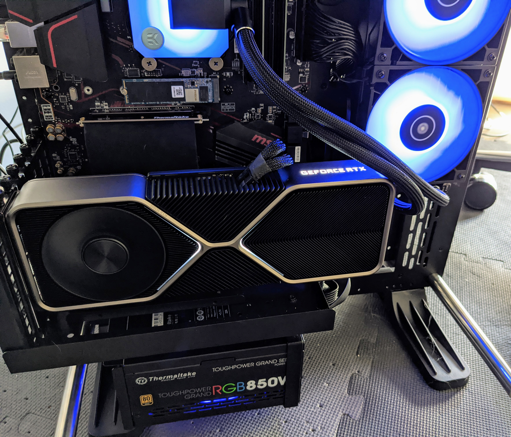
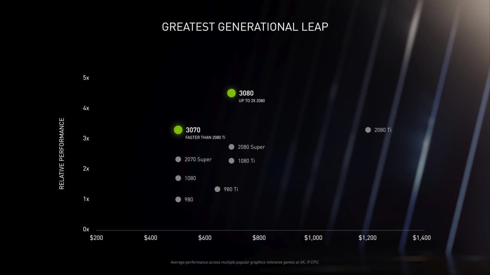
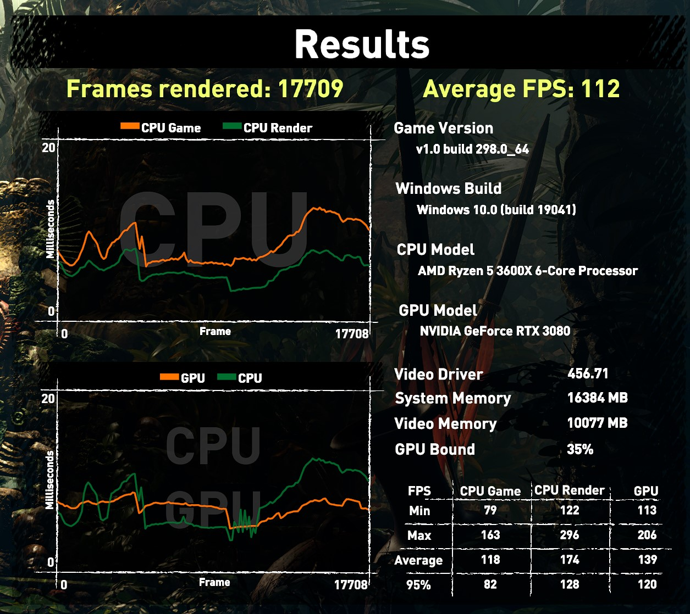

When I built my [$900 budget gaming PC back in June](/n/articles/should-everyone-build-their-own-pc-at-least-once/), I never thought it would become a money pit of sorts. The build is now around $2,200, which is [up from the $1,500 back in July](/n/articles/i-was-so-wrong-dont-build-your-own-pc/).

Why the big $700 jump between then and now? I got lucky by finding the Nvidia RTX 3080 graphics card in stock at Best Buy last week. 

Well, lucky is a relative term; I still had to pay $699 plus tax for it. Considering that inventory for this GPU is expected to be constrained into the new year, it was just pure chance that I found one in stock. 

I had been checking various online retailer sites for the card about 8 times a day for the better part of three weeks. Yes, that's how little inventory, along with high demand, there is. And less than five minutes after I checked out of Best Buy's online store, it was sold out again. Crazy.

Considering that I don't play first person shooters or even the newest game titles, I would have been fine with my prior GPU.  But this series of GPUs from Nvidia is truly a huge leap in terms of chip architecture, memory bandwidth and raw power. And somehow Nvidia is offering that huge leap for the same price or less than the comparable models of the prior generation.

Here's a marketing chart from Nvidia to illustrate the generational jump:

Note I said "marketing chart" because real-world benchmark testing I've seen and read isn't always offering the promised gains. Still, the actual gains are impressive.

Take "Shadow of the Tomb Raider", one of my favorite games, for example. With my older GPUs I would eke out anywhere from 60-ish to 80-ish frames per second at 1080p resolution and mostly high graphics settings.

With the RTX 3080 at 1440p resolution and the highest possible graphics settings, I'm averaging over 110 frames per second on my 144Hz gaming monitor:

Essentially, this card lets me play the game at a higher resolution, with more details and at a faster framerate. 

Again, I would have been fine with my previous GPU. But it seems to me like Nvidia is able to make a big generational GPU leap every other year. Almost like a "tick-tock" cycle the CPU industry often follows. So I figured it was either get in on this GPU generation now or wait two more product cycles before upgrading. 

That thought process got me to play the "RTX 3080 lottery" with a small investment of time and with nothing to lose. Of course, that winning ticket did cost me $700 but I knew that going in. And it's an investment that should last me a good 3, 4, or even 5 years. 

Then again, my budget PC cost is up nearly threefold in four months. Crap.
