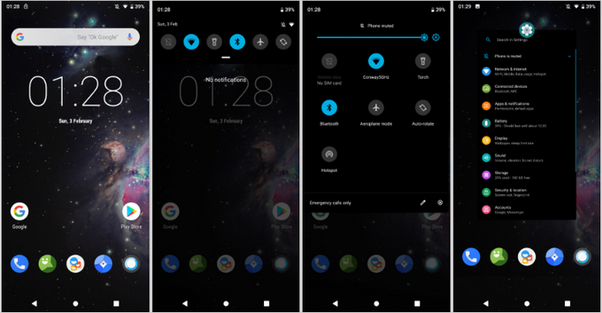
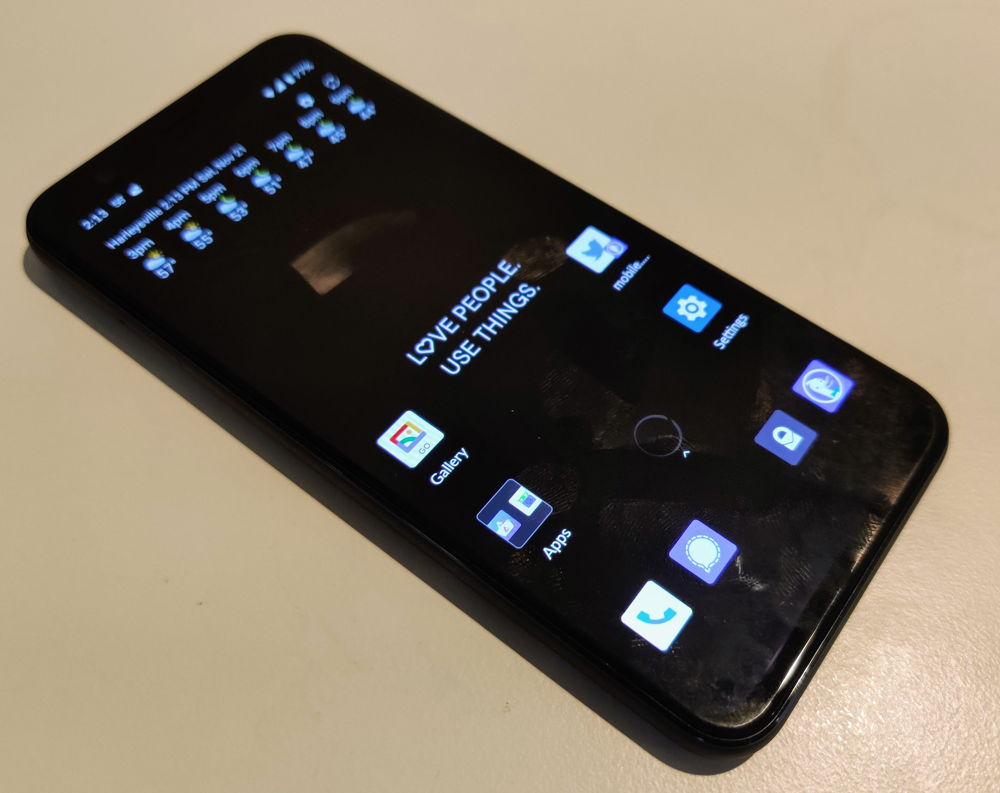
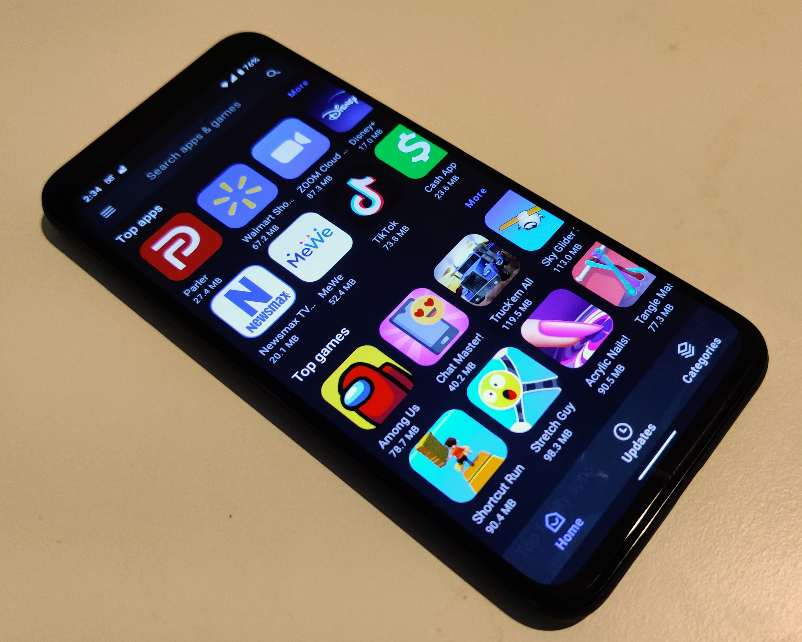

I've been thinking quite a bit about data privacy and the mobile industry lately. They're two separate, but related, topics in my mind. 

At this point, your mobile device is either going to run software from Apple or from Google. There really isn't much choice. [Linux smartphones](https://www.linuxsmartphones.com) are in the works but there's a way to go there before they ever become mainstream options.

And from a privacy standpoint, both Apple and Google devices gather your data; the difference is in what they do with it. Apple, for example, doesn't sell your data although iOS apps certainly gather it. And Google? The majority of its revenue is built upon advertising and services that offer value in exchange for your data. At the end of the day, you're still giving your private data to both companies.

So I decided to try a little experiment over the past few weeks that would limit the amount of data I provide to third-parties on my mobile device. I have a Pixel 4, which of course runs Google Android. So I bought a secondary phone, a $399 OnePlus 7T, for the experiment. Since iPhones are locked down quite well, I decided to take an Android approach. For technical reasons, I ended up switching my approach and now use the OnePlus 7T with Google apps and services while experimenting with the Pixel 4, using custom software.

## A few baseline points to level set this post

My intent with this post is not to bash Apple, Google, or any other big tech company. This is simply an experiment based on some thoughts I've had lately.

I'm not suggesting or trying to convince you to follow in my tracks. If you want to for your own valid reasons, that's fine.

For work reasons, I can't feasibly abandon some of the apps and services that I use. I run a Chromebook site, for example, so I need to maintain a Google account. I also test many Amazon Echo, Apple HomeKit and Google Home devices for my contributions on [an IoT site ](https://www.staceyoniot.com)& [podcast](https://www.iotpodcast.com). This experiment is more geared towards my personal use of mobile devices, apps and services.

## Researching the few available options

I started researching what operating system and app ecosystem might work for my experiment, with the goal being as removed as much as possible from Apple or Google. Or, at the very least, being as removed as possible so that nor more data that is absolutely necessary is going to either company or to app developers.

After a few weeks of research, here's what I found and decided.

There are several custom Android ROMs that are based on AOSP, or the Android Open Source Project, which don't include any Google apps or services. I've known about this for years, but the issue has always been one of security and the ability to find the apps that I need.

[Lineage OS](https://www.lineageos.org/) is probably the most well known of these today and I did consider using it. However, it doesn't include support for something called [microG, which is a limited, open-source implementation of Google Play Services](https://microg.org/). I'll explain more about microG in a bit, but I saw another issue with Lineage OS: After installing it on a compatible phone, I couldn't relock the bootloader.

Let me explain why this is important. Every Android phone has what's called a bootloader. This is basically the first software that runs when you power up your phone or tablet. It verifies that the system software hasn't been tampered with. In order to install a custom version of Android, you have to first unlock the bootloader so you can modify the system software. Once that software is modified, you should relock the bootloader so that nobody can gain access to your phone data or modify the system software. As I found when I installed it, LineageOS doesn't allow for that, so it was too big a security risk for me to use.

I then turned to [GrapheneOS](https://grapheneos.org/), which is a hardened (read: more secure) version of AOSP. It has a development team of one: Danial Micay. And it delivers on its promise: A super secure AOSP phone with access to open-source mobile apps and a way to relock the bootloader. 

If you just need the basics when it comes to mobile apps, or can rely on web apps, plus you want amazing data privacy and security, GrapheneOS is your best bet here. I ran GrapheneOS for a few days and appreciated the security but the phone felt too limited for me to use on a daily basis. 

Somewhere in between LineageOS and GrapheneOS is [CalyxOS](https://www.calyxos.org). And this is where I ended up. 

I've been running CalyxOS on the Pixel 4 -- with a relocked bootloader, I might add -- for about a week. It doesn't quite have the security chops of GrapheneOS but it brings the custom ROM benefits of LineageOS plus the ability to re-lock the bootloader. And it has microG installed. I guess it's time to explain microG, as well as other ways to get apps on a phone that has no access to Google Play.

## Getting apps on a non-Google Android phone

microG essentially allows mobile apps that rely on Google services for push notifications or maps support. That may not sound too impressive but hold that thought because microG works with something called the [Aurora Store](https://auroraoss.com/app_info.php?app_id=1). 

To a large extent, the Aurora Store is a front-end mirror of the Google Play Store. You may not find every app from the Play Store in Aurora, but I've found nearly everything I was looking for. When you install an app from Aurora, it's effectively coming from the Play Store. It's the same code. 

The difference is Aurora can sign in to the Play Store with an anonymous, or throwaway Google account to get the app on your phone. This means Google doesn't know who just downloaded it; there's no connection between you and the app because a Google account wasn't used to download it.

So if you absolutely must have a Play Store app, Aurora can typically get it on your phone. And with microG services, you'll still get the push notifications through Google's messaging system, even though you didn't get the app from Google. 

Aurora is really the second choice for apps in a data privacy situation though. All of the custom ROMs I looked into support the F[\-Droid store,](https://f-droid.org/) which is filled with open-source apps for Android devices. There are some really good ones that either mimic or replicate the typical Google app. I've been living without Google Maps, for example, by using [OsmAnd+ (OSM Automated Navigation Directions)](https://f-droid.org/en/packages/net.osmand.plus/). 

Between F-Droid and the occasional Android app through Aurora, I can do nearly everything I need to do on my Pixel 4 with CalyxOS like I can on the OnePlus 7T running Google Android. In cases where there isn't an app, or I'd rather not have it installed, I use the web version of the app or service.

## To be continued...

Rather than make this a super-long post, I'm going to flip the switch here. I'm still writing the next parts but I'll be sharing my decision-making process in further detail on how I'm choosing which apps to use (or not use), as well as the inclusion of other changes I've made around email providers, cloud storage, browser, search provider, social networking, messaging clients and VPN usage.

I'll give one little tease though: I have a new personal email account at [kevin@kctofel.com](mailto://kevin@kctofel.com). 

It is not an email account associated with a traditional big tech company. I'll explain more in my follow up, but in lieu of comments or questions (since I haven't yet built or adopted a privacy-centric commenting system here yet), don't hesitate to email me feedback or questions.

