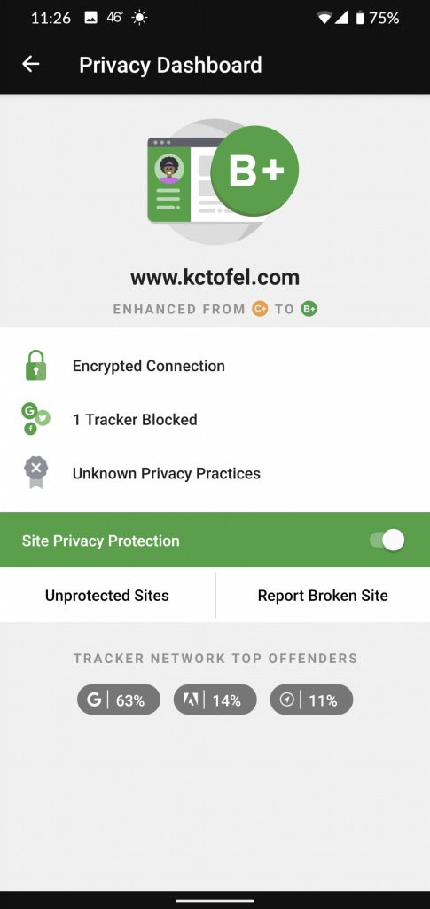
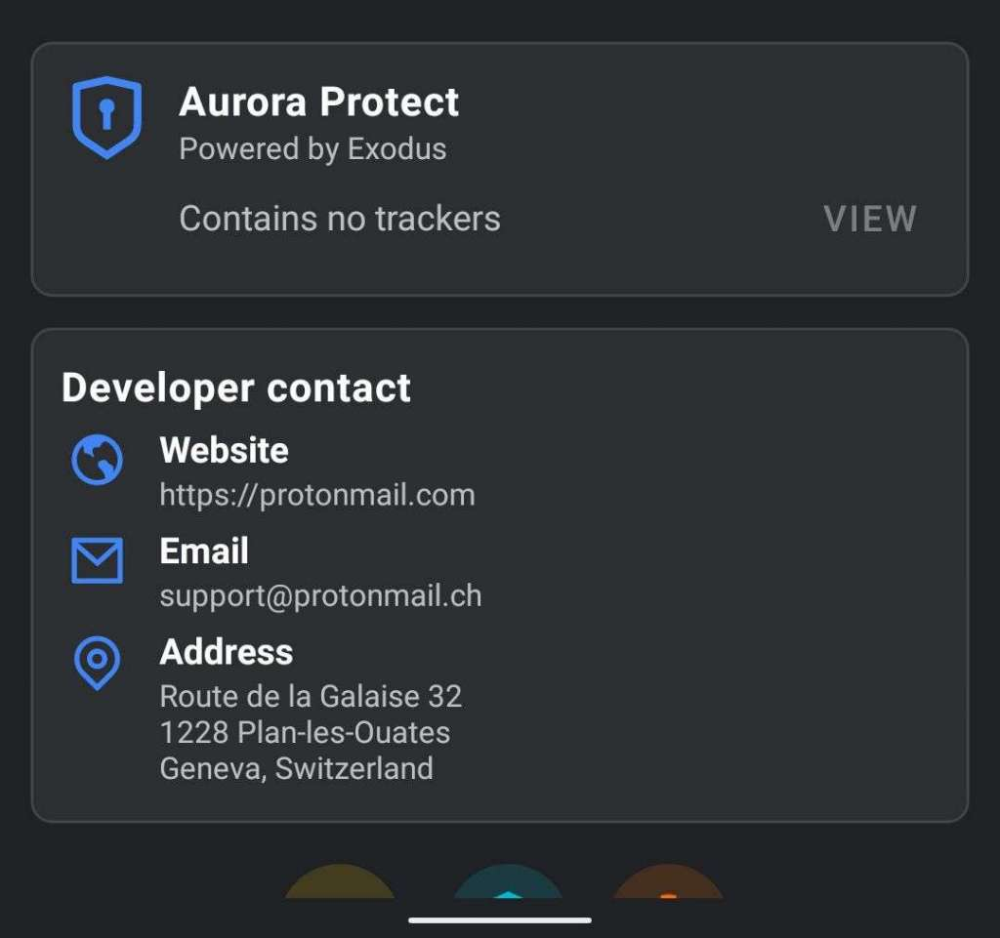
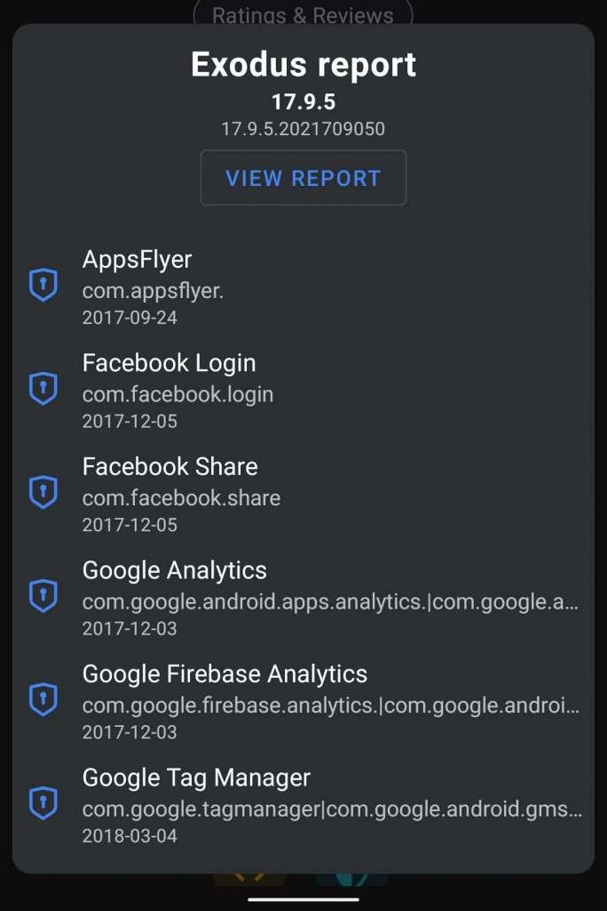
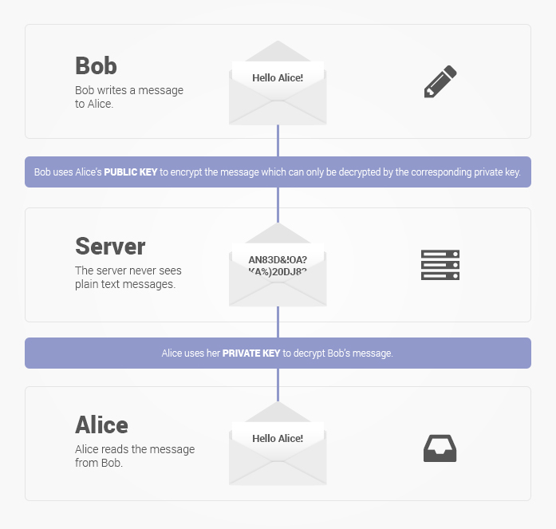
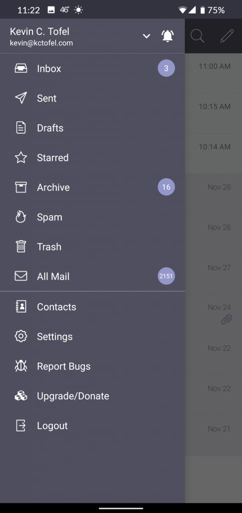
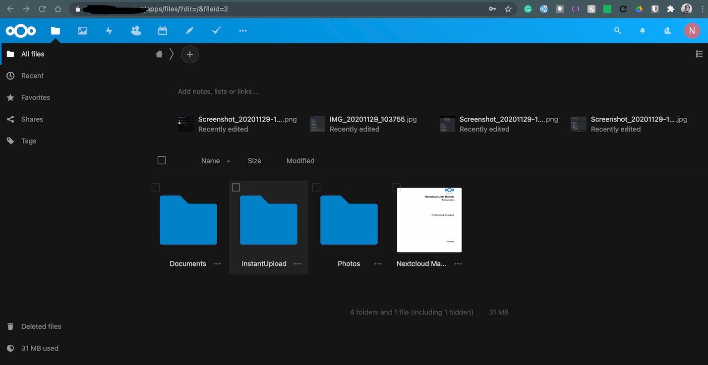

Last week, I shared my current experiment of living without "big tech". I won't recap it in detail but [I'm essentially using a de-Googled phone](/n/articles/the-experiment-living-a-mobile-life-without-apple-or-google/) as my daily driver. I explain why in the prior post, however, the main emphasis is around **data privacy**. And as I also mentioned last week, this isn't a push to get others to follow suit. You do you, I always say.

As a follow-up, today I'll cover some of the choices I've made around mobile applications and email along with a preview of cloud storage strategies.

## I'm now super selective when installing apps

As mentioned last week, my Pixel 4 is running CalyxOS, which is built from the open-source version of Android, or AOSP. That means there are just basic apps installed to give you a minimally functioning experience. 

To keep my data private, I've installed a few apps directly from developers or from the F-Droid store, all of which are open-source. Here's a sample of some:

* Bitwarden password manager
* DuckDuckGo Privacy Browser
* NewPipe (a lightweight YouTube frontend)
* OsmAnd+ Maps & GPS Navigation
* Signal Private Messenger

Bitwarden encrypts and replaces my use of browser stored passwords, which lets me reclaim those from "big tech". I was able to easily export my passwords from Google Chrome and import them successfully into Bitwarden. DuckDuckGo is a perfectly fine mobile browser that not only reports what trackers each site I visit is using, it can block most of them. 

Here I'm using the browser to visit this site, where I do have Google Analytics tracking code. 

That's very handy from a privacy standpoint. And there's an in-app button that closes all tabs and deletes all data from a browsing session. However, you can "fireproof" any website so that some data is saved: Account passwords, for example. I've done this with Twitter's site so I don't have to sign in each time.  

NewPipe replaces YouTube, mainly because the backend is YouTube. I'm able to anonymously subscribe to my favorite content creators. OsmAnd+ for mapping and voice navigation has worked flawlessly. And Signal is my default messaging app on the Pixel 4. Voice, video, and messages between Signal users are encrypted while text messages from non-Signal folks aren't.

Obviously, I can use mobile website versions of some apps through DuckDuckGo. But that's not always ideal. If it was, we wouldn't have mobile apps with more functionality, push notifications, and the like. So I have installed a few apps from the Google Play Store anonymously through the Aurora Store; I explained this in the prior post.

But... and this is key... I carefully evaluate what that app tracks or has access to before deciding to install it. And the Aurora Store has a nice integration with Exodus, which shows me that information before choosing to install.  

Here's an example of ProtonMail, which is my email client (and my email provider - more on that later). No trackers:

Now, consider an app like TikTok, which has quite a few from "big tech" names you'll recognize:

Simply put, I won't install mobile apps on my personal phone that have an excess of trackers like this. I'm fine with certain minimal ones for performance or app-crashing data, but not my personal data.

In fact, I highly recommend heading over to the [Exodus site if you use Android](https://reports.exodus-privacy.eu.org/en/). You can enter any Google Play Store app and get a report on the app trackers and permissions. I'll warn you in advance: you might not like what you see. ;)

## Goodbye Gmail, hello ProtonMail

For the data privacy experiment, I knew I needed a securely hosted email service. I don't feel like rolling my own, so after researching, I decided to use ProtonMail for a few reasons.

* [Open-source for most components](https://github.com/ProtonMail)
* Based in Switzerland, which has some of the toughest privacy laws on the planet
* End-to-end encryption
* No logs or personal information is stored

That last point is interesting because ProtonMail couldn't hand over any of my information even if it was subpoenaed by a government agency.

> ProtonMail's zero access architecture means that your data is encrypted in a way that makes it inaccessible to us. Data is encrypted on the client side using an encryption key that we do not have access to. This means we don't have the technical ability to decrypt your messages, and as a result, we are unable to hand your data over to third parties. With ProtonMail, privacy isn't just a promise, it is mathematically ensured. For this reason, we are also unable to do data recovery. If you forget your password, we cannot recover your data.

Since I have the kctofel.com domain for this site, it was simple to use it for a custom ProtonMail email address. As mentioned previously, until I can create or implement some open-source commenting system here to protect your data privacy, you can reach me at [kevin@kctofel.com](mailto://kevin@kctofel.com).

[ProtonMail offers a free account with limited storage](https://protonmail.com/signup), which I tested for a few days. I then opted to pay for a ProtonMail Plus plan. It's $48 yearly, supports the custom domain, offers multiple email accounts and 5 GB of storage. That's pretty meager but I've culled about 20 GB of old Gmail messages and then imported what was left into ProtonMail, which went flawlessly.

The mail service doesn't have quite as many features as Gmail: I can't snooze a message for example. But otherwise, it's working fine on the web and on the mobile client.

As an aside, I also added a [paid ProtonVPN plan](https://protonvpn.com/), which got me a bundled discount. I now use the VPN service on my phone and my Chromebooks most of the time. I'm paying $10 a month for both the mail and VPN service.

While I'm still in the experimental phase, I still have my Gmail account active. All email there is being forwarded to my ProtonMail account. So Google still sees all of that. And it will unless I decide to move forward with this more privacy-centric approach.

## What about cloud storage?

Like I did with the last post once it got lengthy, I'll stop this one here. The next post will deal with online cloud storage because that too has to be part of this data privacy approach. I'm in a beta of ProtonDrive, which is a basic but functional secure and private option to replace Google Drive, Dropbox, OneDrive, etc... 

However, I recently discovered [NextCloud](https://nextcloud.com/), which is not just a cloud drive replacement but also offers online productivity and other apps. 

Rather than choose a NextCloud provider, I decided to go self-hosted and recently installed NextCloud server on a little Raspberry Pi 4. For testing, I have a 64 GB USB stick in the Pi where my NextCloud "cloud" data is stored. 

Obviously, my hardware is that cloud so no company has access to the data in it. I don't have to pay for storage unless I want to add more hardware to expand it.

More to follow.....

