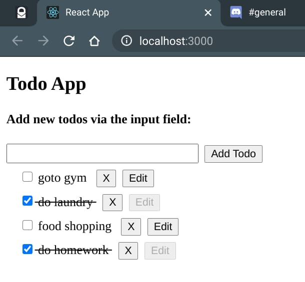
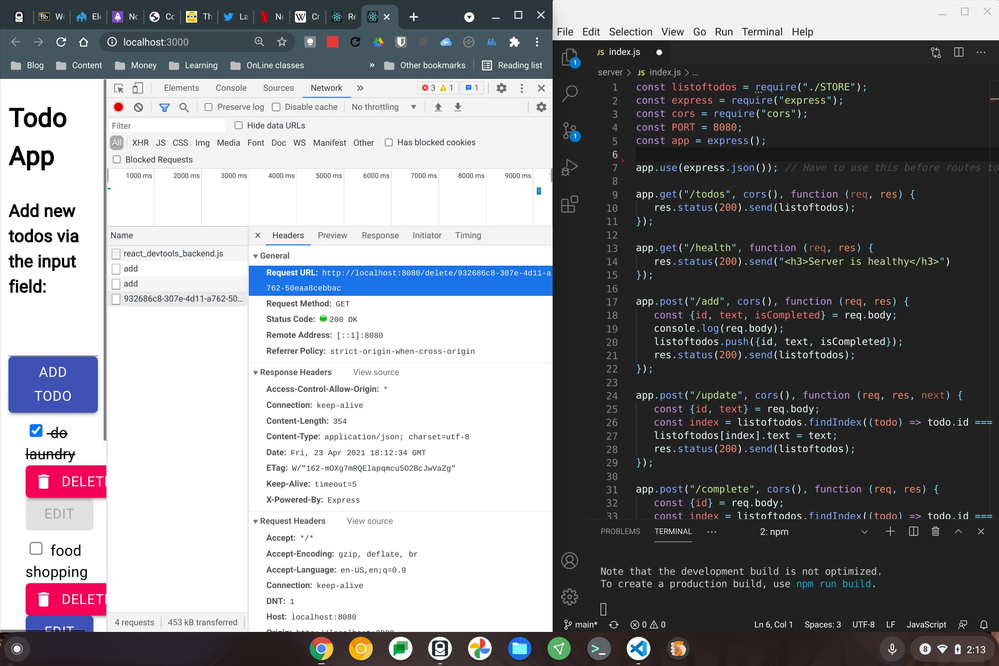
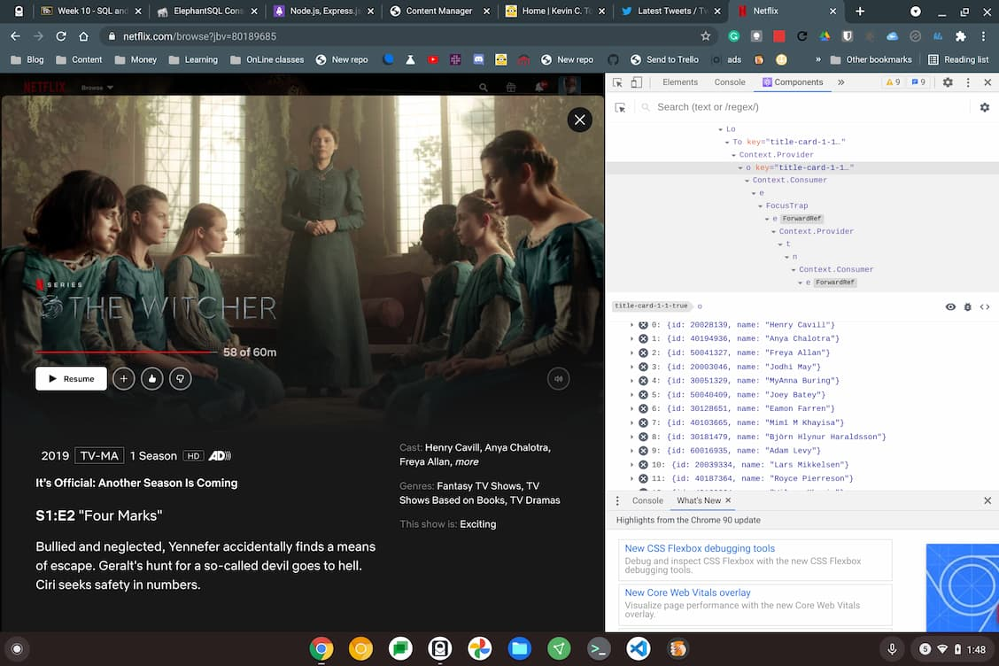
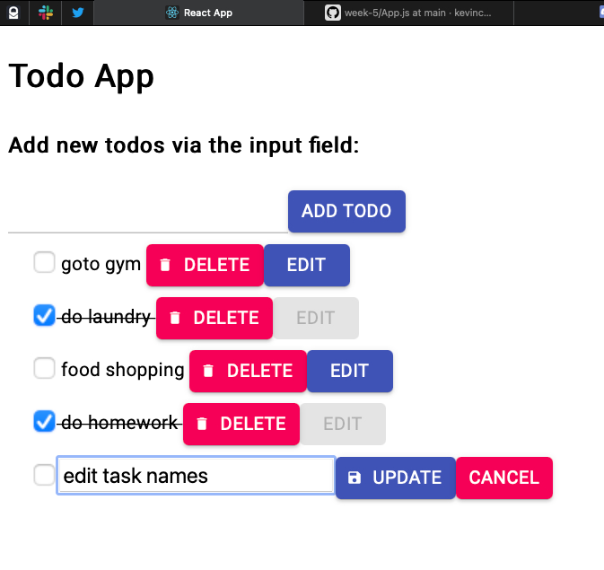

The last time I blogged here was when I applied to the online Georgia Tech Masters in CS program six weeks ago. I'm still waiting to hear if I'm going to be a Yellow Jacket or not. 

While waiting, I've been heads down in my Advanced JavaScript class. The focus has been to take our basic JS skills from the previous semester and build a full-stack application using [React](https://reactjs.org/), [Node.js](https://nodejs.org/en/), and a database.

With a few weeks to go in the semester, we have two of the three pieces in place. 

Last month, I had put together React app that started with all of the UI, logic, and data in it. It's just a standard "to do" app to keep track of basic tasks. I think "to do" apps are like the "Hello World" of React; everyone learning React seems to do one, or something similar.

And yes, it's a simple [CRUD app](https://en.wikipedia.org/wiki/Create,_read,_update_and_delete).

If you're not familiar with the term it stands for four main features found in nearly every (if not every) app: Create, Read, Update and Delete. Almost everything we do on apps uses these basic functions; and a lot more behind the scenes, of course.

As of last week, I pulled the logic and data out of the client and put it on a Node.js server. This part was actually more interesting to me. 

In a sense, you could say we built *very* rudimentary APIs for our application on the server. Our client app calls the server for all of its functionality by making an http fetch request. I have routes, or endpoints, on the server to handle each function: add, edit, or delete a task. There's a "mark completed" action as well. 

With the data all on the server, it's a little more persistent. When the data was in the client, each browser refresh would reset the tasks, for example. Now, the server acts as the "book of record" for the task data; it only goes back to the default tasks if the server is restarted.

Of course, for even better persistence, we'll be moving the data from the server onto a database. We'll be doing that next week using PostgreSQL. 

We could do this on local machines, which is what I'm doing now: I have both an Express web server and a Node.js server running on different ports of my Chromebook. But I'd rather use some cloud database, so [ElephantSQL](https://www.elephantsql.com/) is an option suggested by the professor. It's free for my limited usage and it should stay running all the time, which I'd prefer.

I have to say, I'm really becoming smitten with the whole React / Node.js / database stack. I'm not suggesting it's the best or that there aren't other options. But it's pretty approachable and reasonably capable for web app development. 

I had heard of React and Node.js before taking the class, of course. Until now I only had a high-level view of them. And I had no idea what web apps I use on a daily basis are built on React for the front end; I don't know what the backends are so I'm excluding Node.js here, of course.

I don't use Facebook -- I basically [stopped in November of last year on a data privacy kick](/n/articles/the-experiment-living-a-mobile-life-without-apple-or-google/) -- but of course, Facebook is a React app. React was originally born out of Facebook. Here are a few other apps I use that are built on React though:

* Discord
* Reddit
* Netflix

Indeed, using the [React Developer Tools Chrome Extension](https://chrome.google.com/webstore/detail/react-developer-tools/fmkadmapgofadopljbjfkapdkoienihi?hl=en), you can see information from the Netflix content. Here's an array (or list) of the actors in The Witcher, for example, that the app view has access to.

Again, I'm not suggesting that React should be your library of choice for building apps. But it's a solid enough choice that some big names are using it. 

Anyway, my "to do" app is nearly done and it has given me the tools needed to implement some other app projects I have going on the side. Nothing fancy or something to build a company around; just some apps that solve a particular problem I have that no other app currently does.

And sure, my "to do" app is just a typical CRUD app. More importantly, though, I built it. It's ***my*** CRUD app. And that makes me feel good. ;)

Oh, while we don't get "style" points in class for our apps, I've been getting my weekly assignments done well in advance. So I've had extra time to tweak the look of my app. 

I'm using [Material UI](https://material-ui.com/) for my font, input fields and, button components. A few lines of code and some slightly different elements is all it took.

I know, I know. I still have to get things lined up nicely in the UI yet. That's a task for this weekend!

