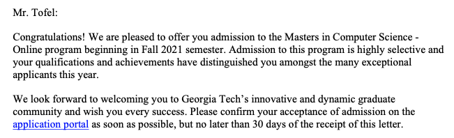
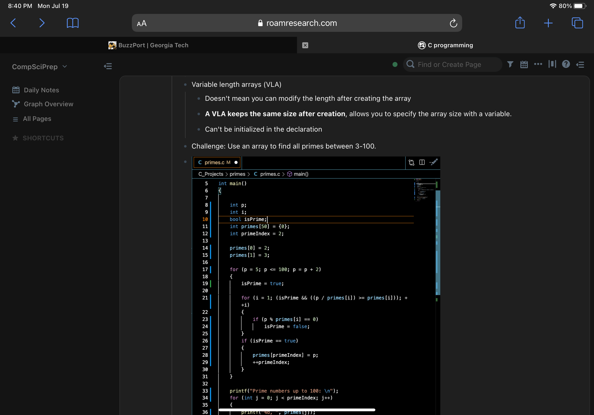

What a slacker. I just realized I haven't posted here since April. And so much has happened since then! Time for a recap from then to the present because I'm literally drowning in C, as in the programming language.

Why? Because somehow I was accepted to the fall cohort of Georgia Tech's online Masters in Computer Science. I turn 52 next week and two weeks after that, I start my first semester. Go figure!

That letter arrived in early May, so I've been getting all of my supporting documentation in to the school, doing the online orientation activities, and getting my GT accounts set up. Normal stuff, really.

But I also started looking at the classes because we n00bs to the program register for the fall in mid-August. All current students have already registered so I may not get the class I want. I'm OK with that. Everyone has to be the n00b at some point.

So my strategy is to carefully select a few choices, even if I'm waitlisted for some or all of them. And as I looked through the offerings, I realized I had a glaring skill deficiency: I've never coded in C. Some of the classes rely heavily on C, not Java, Python, or web languages, which I do have experience with.

I decided to use the summer to fix this problem by taking an online C course. And that's where most of my free time is spent these days. 

Interestingly, my Java experience translates really well to C. Then again, I haven't gotten to the lessons on memory allocation and pointers, which are foreign concepts in Java. 

I'm also using the time to figure out how to best organize my class notes once the semester starts. I've tried a number of online solutions and decided to go with [Roam Research](https://www.roamresearch.com). It's a little expensive at $165 annually but it meets my needs perfectly. 

Here's an example of my notes along with a basic C coding assignment from the online class. Roam supports image imports as well as code blocks and many other features that I really like.

What's great about this whole process is that it's teaching this n00b coder that computer science is essentially computer science, regardless of programming language or syntax.

For example, having learned data structures in Java, I basically already know data structures in C. Sure there are some slight differences but an array is an array and a stack is a stack. It doesn't matter what language you implement the structure, the concept is the same even if the syntax or memory management is different.

In the same regard, loops are still loops, variables are variable, and... well, you get the idea.

So I'm slogging through C as quickly as I can before classes start, although my pace is faster than I expected. The takeaway here from one n00b to another: ***focus intensely on programming concepts because most of them apply to whatever language you use or learn***. 

And to that end, switching from one language to another isn't as challenging as you might think, provided you have solid fundamentals of the concepts. It's even easier if the language you know is similar to the one you have to learn, such as the case from my Java experience easily translated to C programming.

Before I get back to my immersion in C programming with more coursework, I've should note I've also been working on some small side projects. 

These are personal apps so I won't share the details (for now). 

Suffice it to say, I'm stretching myself with a [MERN application](https://www.mongodb.com/mern-stack), i.e.: MongoDB, Express, React, and Node. It's early yet but I do have my Node server successfully GETing data from my MongoDB in the cloud. :)
