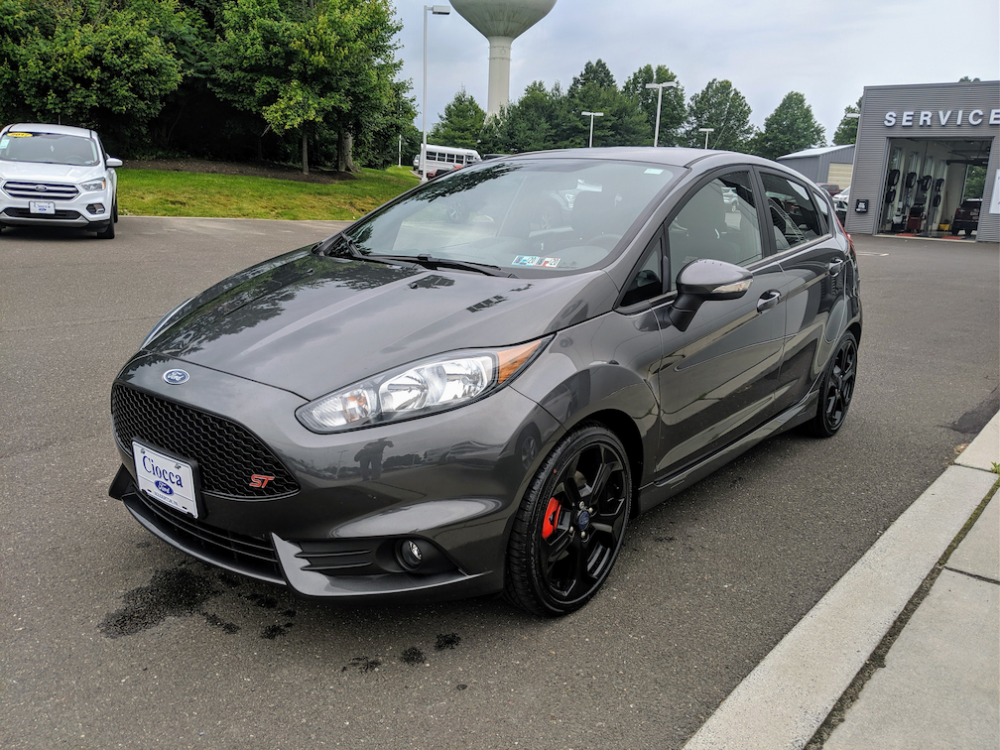
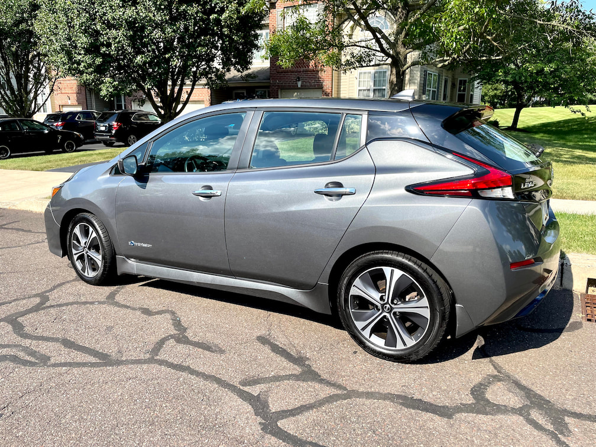
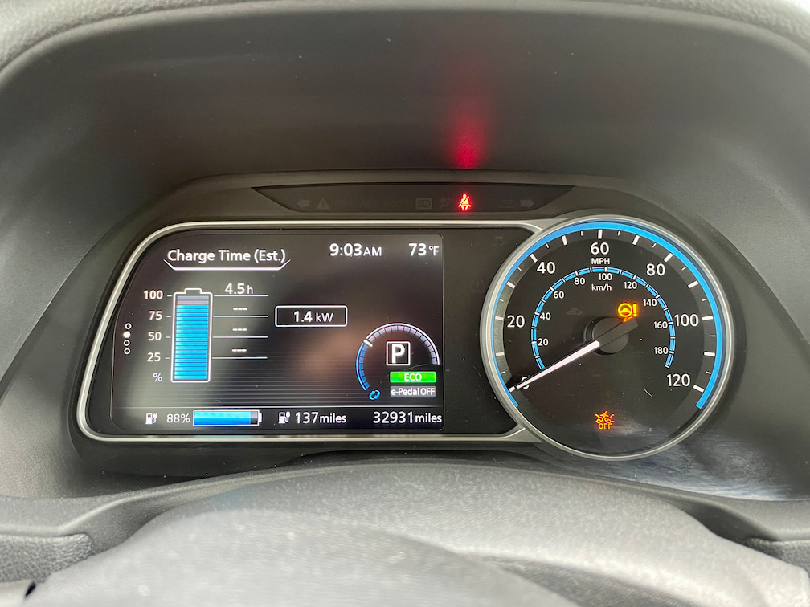

As I get older, I'm starting to appreciate "things" more. And by things, I mean particular physical objects that I need, not that I want. See the [most excellent new Minimalism documentary on Netflix](https://www.netflix.com/title/81074662) and you'll better understand what I mean.

One of the "things" that I need to have is a vehicle. But most of the vehicles I purchased were ones I wanted, even though there were less expensive options that were better for the environment. 

Prior examples: A 2008 Corvette. A 2016 Golf R. 

So two months ago today, I sold a very fun car for a very almost fun car. Yup, I went electric.

The car I traded in was a manual 2019 Ford Fiest ST. 

I enjoyed using the stick shift, spooling up the turbocharger and driving it like it was a go-cart. I bought it new in 2019. And over the two years that I had it, I put roughly 4,300 miles on it. Working at home and dealing with COVID-19 for much of that time are the main reasons the mileage was so low.

Because of the current chip shortages affecting the new car industry, as well as many others, used car values have shot up quite a bit. And I found a dealer that offered me slightly more than I actually paid for the car when it was brand new.

After about 30 hours of research and comparing the findings with my needs, I decided to get a used, 2018 Nissan Leaf SV. It cost me less than the value of my Ford, just came off a lease and had 37,000 miles.

Why not a Tesla or some other electric vehicle? I simply don't need something that expensive, no matter how much nicer they are in any number of ways.

Frankly, the Leaf is comfortable, has plenty of room and does the same thing as more expensive models. But, it also has its limitations, the largest one being it's not made for long travel. 

The 40 kWh battery (of which 38 kWh are usable) has an estimated range of 150 miles, for example. And the DC fast charging it supports is slow by Tesla standards, although I can go from 0 to 80% battery capacity in just under 40 minutes. 

But I obviously don't drive much. I do a few miles here and there around town or hop over to the local WaWa to grab some lunch every few days. So I'm only charging it every two weeks or so. 

In fact, I'm using a car charger with a standard 120 V outlet. I only gain about 4 to 5 miles of range per hour with this method, but it's easier on the battery. And frankly, I don't typically need to go anywhere very far all of a sudden. If I know I'm going to drive 50, 75, or 100 miles, I just plan out my charging.

I may invest in the addition of a 240V outlet in the garage because the charger I have works on either 120V or 240V. That would speed up my recharge time by a factor of nearly four. We'll see.

For now, I'm just enjoying the relaxing silence of driving a quiet, zero-emissions vehicle. I still stomp on the pedal on the rare occasion and get a taste of that instant torque, but that's not often.

And I'm enjoying my rides past all of the gas stations I used to stop at. Sometimes I even smile as I drive by.

