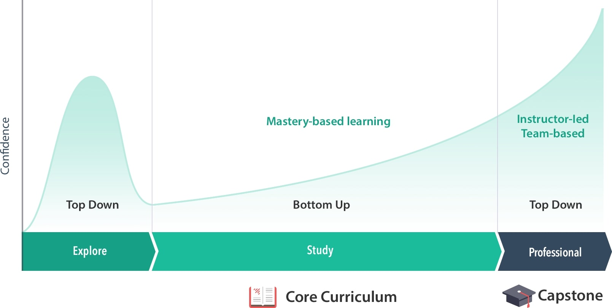

Anyone who knows me even a little knows that I can't sit still when it comes to my education. Sure, I'm 52 but there's always time to learn more. That's why I went to my local community college at age 48, even though I already have a bachelor's degree. And it's why I started Georgia Tech's online Masters in Computer Science program last year.

[That didn't work out](/n/articles/so-ends-the-great-masters-in-cs-experiment/). And I'm OK with it.

But my brain can't sit still. So a week after deciding not to continue at GT, I did some research about an online CS program called [Launch School](https://launchschool.com/). It's actually the second time I did this research: I found it in 2018 but then opted for CS classes at the community college. I'm glad I remembered this program.

In fact, I'm now a student at Launch School: A Javascript padawan that aspires to become a Javascript Master.

Indeed, that's what Launch School offers and how it approaches the education of programming. It's a Mastery Based Approach, which completely turns education on it's head. 

Instead of taking classes with a set timeline and getting as much (or as little) as you can out of them, Launch School focuses on mastering information. How long does that take? As long as it takes! 

See, you don't move on from one class to the next at a set point in time with this method. Instead, you take as much time as you need to master the course information. When you think you're ready, you take an assessment. That will test you to see if you've acquired all of the coursework concepts necessary to proceed to the next course. 

And that makes sense: If you haven't mastered the fundamentals in JavaScript 101, for example, how do you expect to master those in JavaScript 201?

Aside from this approach that really speaks to me: I decided on Launch School because of what it could provide that I didn't get out of the GT program: A very active group of helpful learners that are highly engaged, and regularly scheduled online video chat study groups.

Now I haven't yet taken advantage of the latter, but I sure have with the former. I'm connecting with my peers on a daily basis in Slack. There are great programming conversations, tons of questions (along with quick, detailed answers), and even a Pet Photos channel. So Norm gets his chance to be involved too.

So while the Launch School program sounds similar to GT (being asynchronous and completely online), it still fulfills my social engagement requirements of online learning.

One of the interesting aspects of Launch School is that you don't pay a thing until you pass the core preparatory work. This includes information on Mastery Based Learning as well as a gentle introduction to JavaScript or Ruby. The program teaches both front- and back-end development, with your choice of JavaScript or Ruby for the back-end. Since I've already taken JavaScript classes and really like using NodeJS on the server-side, I opted for the JavaScript track.

All told, I spent about five weeks on the prep work, and that's with some JavaScript knowledge. I averaged around three, maybe four, hours a day on the prep work. So it's not a quick, little path to get going. The idea is that before you start paying for Launch School, this prep effort will let you know what the Launch School methodology is like. If the style doesn't fit you, it didn't cost you anything. If it does, you're good to go.

So now I'm paying for the program, which is $199 a month. There's no long-term lock-in though, which is also unique, as compared to a bootcamp. It's a monthly subscription model. You can pause your subscription if you want to or need to. You can stop your plan and pick up where you left off months later. I definitely appreciate this even though my intention is to work through the program without any interruptions.

Oh and even though I have written some JavaScript and NodeJS apps (nothing amazing but still...) I've already learned a few things just in the prep work. See, this isn't about learning a little code syntax and creating a few standard projects. Launch School is teaching everything at a depth I haven't seen in any of my prior classes, any YouTube coding videos, or even some other great resources such as FreeCodeCamp. 

Launch School is teaching an approach to problem-solving, thinking like a programmer, and then having the knowledge to implement solutions. While you can't "teach" every single method of every object, you can learn how to read developer documentation to fill in gaps as needed. That's something I was never taught and I have a new appreciation for the [MDN web docs created and maintained by Mozilla](https://developer.mozilla.org/en-US/).

Long story short: I'm in my happy place, learning about web development with a great bunch of classmates in a program that will hopefully turn me from a JavaScript padawan to a JavaScript Master. Of course, I'll have to pass the trials. (IYKYK!)

