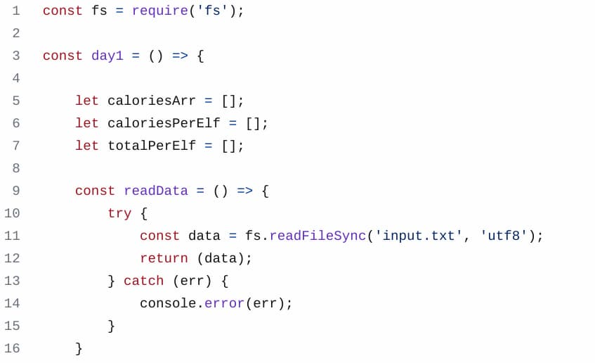
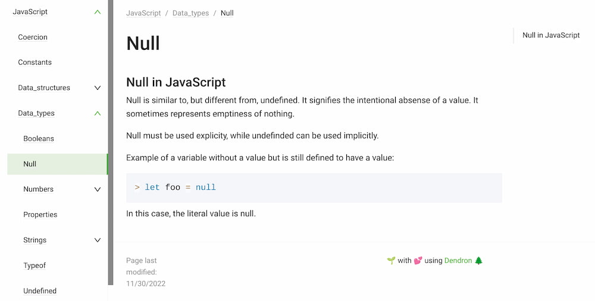

I know when I'm beaten and this week, I was beaten. I surrendered to Santa's elves after just a few days during [the Advent of Code](https://adventofcode.com/). No more stars for me. At least not for a while; I can always go back and tackle the coding challenges in the future.

I had high hopes initially, even knowing that my limited JavaScript skills didn't fully prepare me. And I'm satisfied that I was able to complete both parts of the first few daily challenges. Not only were my existing skills tested, but I added some new ones. 

The [first JavaScript course at Launch School](https://launchschool.com/curriculum/courses/804d1cae) doesn't teach you how to fully use Node.js, for example. So when I had to read in a data file for each challenge, I learned how to use [Node's file system functions](https://nodejs.org/api/fs.html)

All in all, I consider this year's Advent of Code meager participation a win. Anytime I can push boundaries and learn more is a good thing.

## My personal brain dump of JavaScript

Speaking of learning things, I previously mentioned the use of [Dendron](https://www.dendron.so) for my JavaScript preparation notes. This VS Code extension is great for writing Markdown notes in a structured hierarchy. This week I learned how to publish my notes on a GitHub Pages site using a Next.js template and the Dendron CLI.

I had this running on my local machines last week. Now it's out on the web; at least for now. I may change my notes to private in the future. Until I do, you can [see how it works right here](https://kevinctofel.github.io/JS109_assessment).

I only got the publishing aspect working very late last night. So the "home" page is a filler template that I need to customize. More important is the left sidebar showing my note hierarchy. 

And the built-in search bar is awesome: Start with a "/" (no quotes) and begin to type JavaScript, Arrays, infinity, variables, or some other keyword. Watch the quick and accurate results! 

Best of all is a GitHub Action I have for this repository of notes. Whenever I commit new notes to GitHub, it automatically rebuilds the site with the latest brain dump!

## So long Insta?

This week I also downloaded all of my Instagram data. I haven't closed my account yet but I'm considering it. This morning, I created a new account at metapixl.com, which is one of a few Pixelfed servers. 

Yup, this is part of the same Fediverse as Mastodon. 

In fact, using Mastodon, I can follow others on Pixelfed instances, which is slick. I'm still working through how all the Fedviers pieced connect and play together from a workflow standpoint. There's always more to learn!

In fact, that's one of the driving forces that keeps me happy and sane. I try not to let a single day go by without learning something new. It's a mantra that I've included in most of my adult life and it has served me well. Maybe it's one that can do the same for you.

