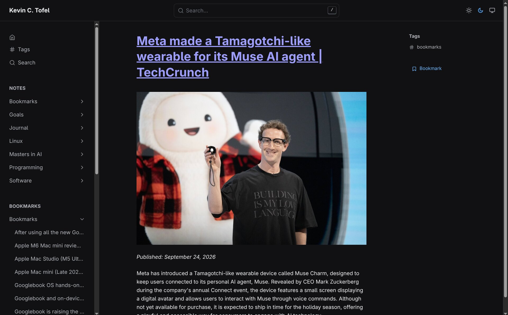
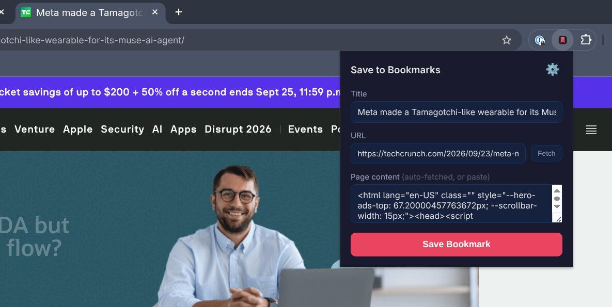
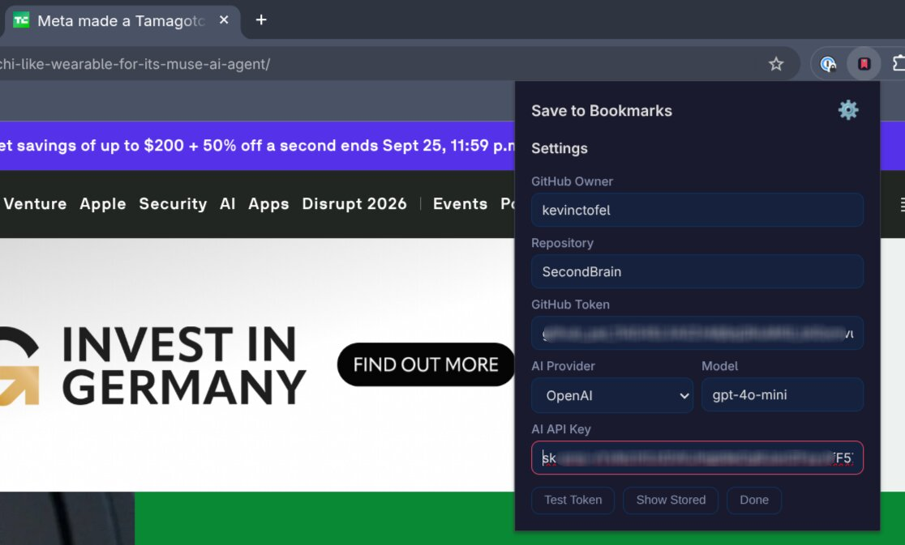

I've been saving interesting articles in bookmark managers for a long time, but lately I've been on a "control as much of my data as possible" kick. Some services I serve on my own homelab, for example. So I decided to retain my bookmark data starting with GitHub (for now) and eventually localize it. This decision was easy because my blog is hosted on GitHub as basic markdown files. And I wanted to integrate the bookmarks with the blog for two reasons:

1. People could see what I've bookmarked, in case of interest.
2. I often write about things that I've previously bookmarked.

So, with the help of my local AI models, I built a Chrome extension that does this in one click.

## How it works

You open any web page, click the extension icon, and it pre-fills the article's title and URL. It automatically fetches the page's content, asks OpenAI for a two-to-three sentence summary, finds the article's main photo, downloads it, uploads it to my GitHub repo, writes the markdown file, and pushes everything to the main branch. My blog's deployment picks up the commit and rebuilds the site within a minute. 

The bookmark lands in a new top-level `Bookmarks/` folder in my blog repo. Each one is a standard markdown file with front matter (title, URL, date, summary, image path) and a short body. The blog theme renders them like any other post, but with a few twists: the title is a hyperlink back to the source article, the image only appears on the individual bookmark page, and the article's original publication date is preserved.

The extension is a standard Chrome Manifest V3 package: a service worker (the background brain), a popup (the UI), and a small content script that runs inside the web page itself. For testing, I added some buttons to verify my API keys and I still need to remove those. Otherwise, it works well. I do want to add some functionality to prune and delete bookmarks but that's for later.

I'd also like to port the extension to Safari for my iPhone. I'll have some Safari specific tweaks to make but the content script and GitHub upload logic should carry over. The real value is in the AI summary, which gives me a reason to revisit the article later without re-reading the whole thing.

Of course, you need to be an Apple Developer (for $99 a year) to do this, so it's on the back burner for now. Ideally, I'll get this ported over to Safari for iOS so I can bookmark articles on the go.
