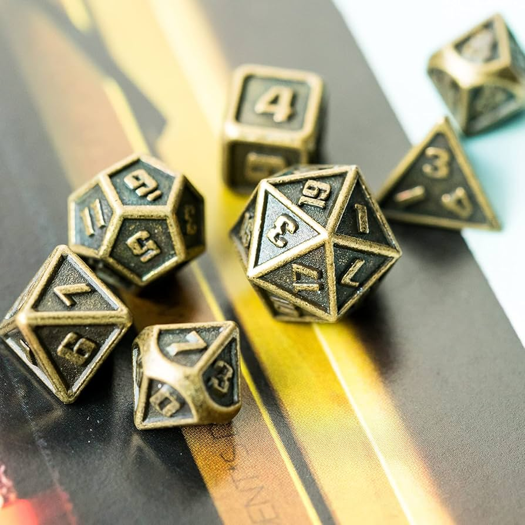
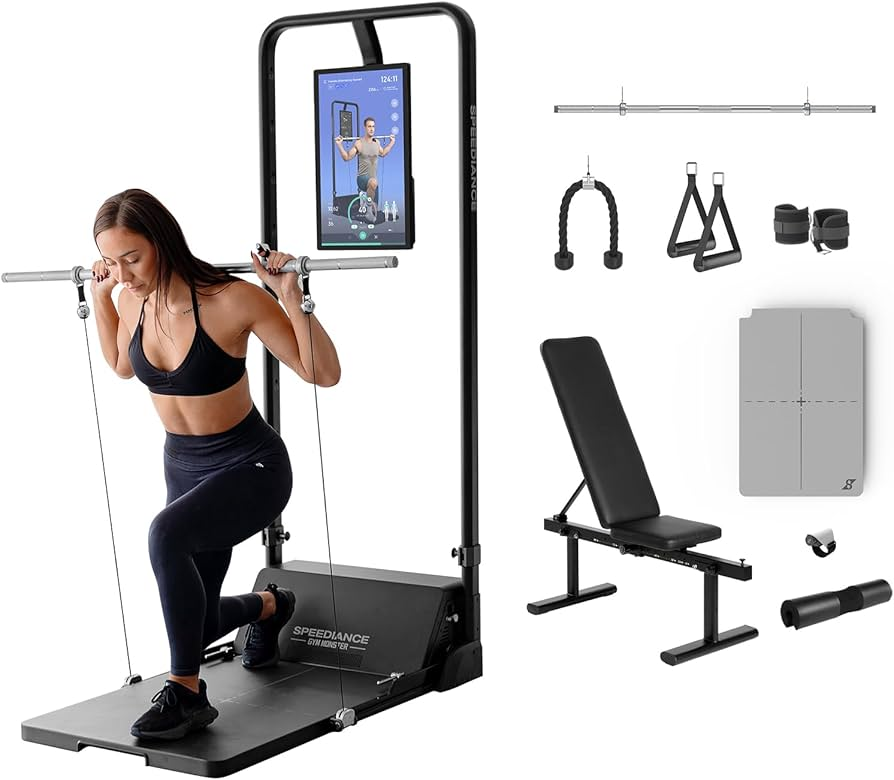
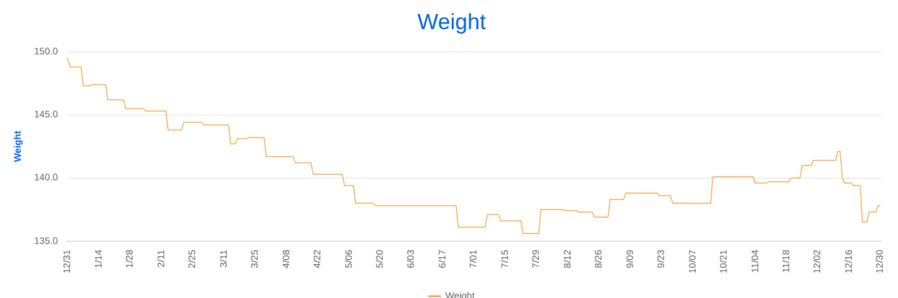
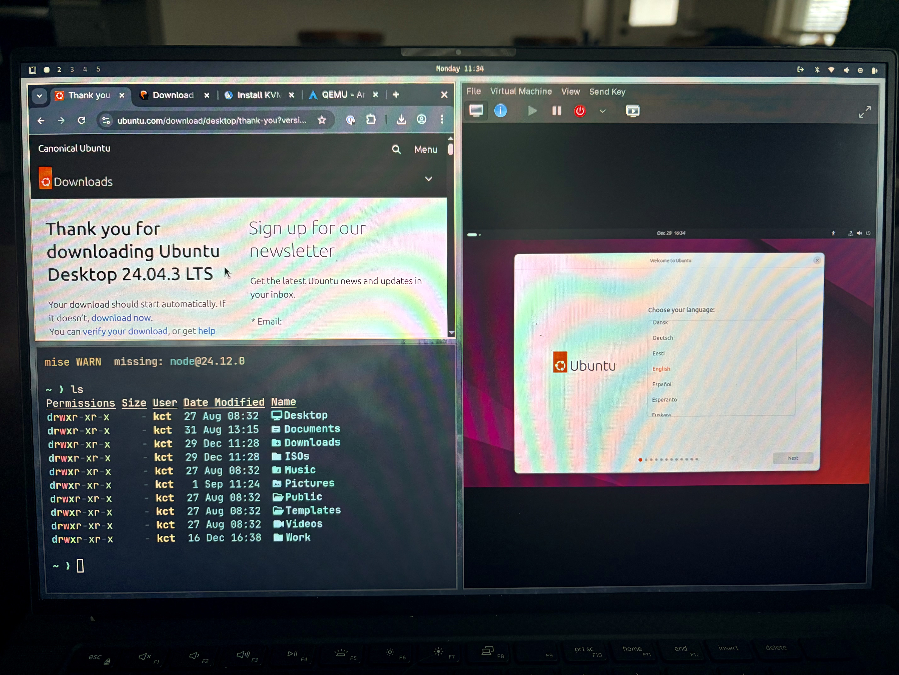
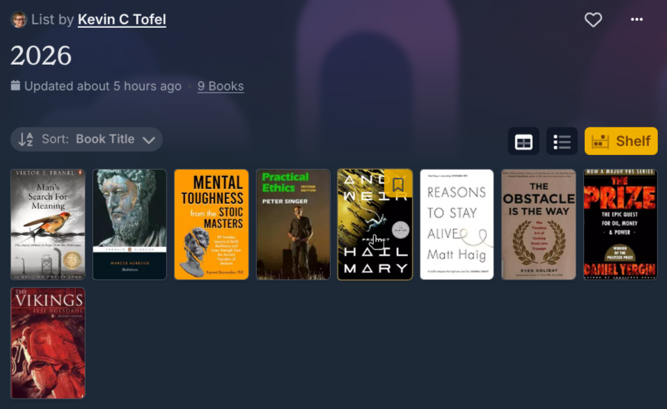

After reflecting on 2025, I spent a few hours planning the life I want in 2026. And I decided to have a little fun with it. 

Instead of simply creating a list of goals, I first evaluated myself as if I were a Dungeons & Dragons character. 

Why? Because with some modern interpretation, the six character attributes found in D&D are interesting, encompassing most of the main attributes of just about anyone today. And I think it's a fun experiment, providing a numerical value to each attribute.

If you're not familiar with those six attributes, here they are:

- Strength
- Dexterity
- Constitution
- Intelligence
- Wisdom
- Charisma

They're all fairly self-explanatory. In the game, the attribute scores typically range between 3 and 18. Each attribute value is randomly generated by throwing several dice. Obviously, I'm not doing that. 

Instead, I reviewed a few sources, linked below, that "translate" the values of each possible number in all six attributes. I also took some online quizzes for IQ and EQ. And I evaluated my own interpretation of these attributes to help adjust the scores. 

- [Real Life D&D Stats Quiz](http://www.kevinhaw.com/add_quiz.php)
- [Emotional Intelligence Test](https://www.thevividmind.org/blog/test/emotional-intelligence-test/)
- [D&D ability score ranges described](https://www.reddit.com/r/dndnext/comments/81cras/dd_ability_score_ranges_described/)
- [D&D stats explained](https://www.wargamer.com/dnd/stats)
- [Real life ability scores](https://www.dragonsfoot.org/forums/viewtopic.php?t=90604)

# Reviewing my six attributes as a baspeline

If I were a D&D character starting in 2026, here are my attribute scores.

|Attribute|Value|Description|
|---|---|---|
|Strength   | 10  |Lifts heavy objects for a short time. Can perform simple physical labor for a few hours without break   |
|Dexterity   | 11  |Slightly above average playing darts. Capable of catching a small thrown object most of the time. Can juggle 3 balls for a short time.   |
|Intelligence   | 15  | Fairly intelligent, able to understand new tasks quickly. Able to do math or solve logic puzzles mentally with reasonable accuracy. IQ around 140|
|Wisdom  | 16  |Often used as a source of wisdom or decider of actions. Can separate emotions from a situation to make rational, logical decisions. Knows a little about a wide variety of things.   |
|Constitution   |11   |Mostly healthy, expected lifespan from mid to upper 80s. Sick every 6 months or so. Can run 3 to 4 miles without stopping.   |
|Charisma | 14 | Above average emotional awareness and relationship management. Often popular or infamous. Knows what to say to most people and is very confident in debate |

## Strength

This is my lowest attribute score, but only by a little. And it's not surprising. I ran for 35 years but never strength trained. I also stopped running regularly in 2019, so other than walking at work and some hiking, my leg strength is reduced from what it was.

In November, I made a commitment to changing this. I invested in a [Speediance Gym Master](https://www.speediance.com/products/speediance-home-gym) and committed to three or four workouts per week
.

This "AI" smart gym has already proven effective for me. I'm already seeing small strength gains and some physical changes in my body composition. I'll continue this plan in 2026.

The best way to evaluate my progress isn't my physical composition though. The Speedience has a smart assessment feature to determine your max one rep weight in four different areas. 

For baseline purposes, here are the numbers from my end of November assessment:

- Barbell squat: 180 pounds
- Barbell bent-over rows: 143 pounds
- Barbell bench press: 101 pounds
- Seated barbell should press: 88 pounds

I'll take the assessment every few months in 2026 to look at the hard data.

## Dexterity

This is a tricky attribute to improve, but after some thought, I do have some ideas. These include, in no particular order:

- Taking an advanced motorcycle riding class as I've only done a basic one.
- Revisit my passion for football (aka: soccer) not just by watching it every week but by finding a team or league to play in the warmer months.
- Plan some unique experiences, such as the local rock climbing gym or the golf simulator across the street from where I live. Perhaps some boxing or matial arts classes could work too.

## Constitution

In 2025, I made positive strides towards a more healthy lifestyle. My main efforts were tracking my meals every single day and setting certain caloric/macronutrient goals to reshape my body. I paid for a yearly MyFitnessPal subscription for this and it was worth every penny.

Although I didn't meet my nutrition goal every day, I did for most of them in 2025. I plan to continue that approach, and possibly add different approaches in 2026.

In 2024, I weighed 154 pounds and my body fat percentage was over 25%. I ended 2025 weighing 138 pounds with just under 21% body fat. My goal for 2026 is **to weigh 145 pounds with a body fat percentage at or under 17%**.

While my strength training and aerobic exercise will help with this, I learned in 2025 how much of an impact nutrition plays. I'll continue to avoid processed foods and choose my meals wisely, both at home and away.

I also neglected some medical tests and routine checkups in 2025, so I already put reminders on my 2026 calendar for those.

Lastly, when I was younger and able to run a marathon in 3:19, this score would have been much higher. These days, I have much less endurance and get sicker a little more often.

To that end, a mid-range 2026 goal is to get my 5K race time to a respectable level. In 2019, I achieved All American status for my age group with a 20:59 5K. That's not going to happen, realistically. However, I think **a 25:00 5K at my age is a good target**.
## Intelligence

It may appear difficult to separate Intelligence from Wisdom, and I do see some overlap. However, I do have a clear goal in 2026 specific to intelligence.

My plan is **to take and pass the CompTIA Linux+ certification exam**. 

I've dabbled with Linux since 2008 and, more recently, have learned enough to transition all of my devices to run Arch Linux. But I have so much more to learn. Not for a job, although I'd consider it, but for increasing my intelligence on a topic that I enjoy learning about and using.

To that end, this week, I bought a lengthy study guide and installed Ubuntu in a VM on my Arch Linux laptop. And I already learned something: virtual networks are a pain to configure. I couldn't get Ubuntu to use the network capabilities of the host machine but [this article was quite helpful](https://tanis.codes/posts/virt-manager-qemu-arch-linux/)

## Wisdom

As mentioned, wisdom is slightly different from intelligence. So I placed this list of books I curated and want to read in 2026 in this category.

Note that I chose nine titles and they're not all non-fiction. It's wise to have fun too. My plan is for at least one title per month, which gives me leeway to add more over the year.

If you want the details on these books or to see the list as it progresses this year, you can find it on [Hardcover](https://hardcover.app/@kevinctofel/lists/2026), an open-source GoodReads competitor that I financially support.

Additionally, I'll keep exploring my minimalism lifestyle. I started this journey in 2019 and the benefits have been immense. 

I've been able to define "how much is enough" when it comes to money and possessions, for example. I've reclaimed countless hours of free time by not having to manage or clean more things. I haven't however made the most of that freed up time, however. So in 2026 I plan to **limit somewhat wasteful activities** such as mindlessly binging different video series', or simply napping out of boredom. This is measurable through my screen time and sleep tracking.

Finally, I plan to get back to journalling, daily if possible. I set up this very site to house my knowledge, my daily thoughts, and some long articles. I got away from using it in 2025, but am committing to reverse that trend in 2026. 

## Charisma

When it comes to this attribute, I think I score high around most people in most situations. However, living alone and navigating the modern dating scene has shown me I have more to do in this area.

In no particular order, my goals here are:

- Learn more about what I want in relationships.
- Understand what others are looking for in the same.
- Stop staying at home on my four non-work days and venture out to new places to meet new people.
- Dive into my personality traits that may have been attractive in the past but don't quite fit at this stage of my life.
- Find new like-minded groups, both online and in person, to share ideas and expand my own.
- Step out into the forefront more with additional public writing and more public speaking.

While these aren't quite as concrete as I'd like, they will provide a framework to build upon in 2026.

## What D&D character would I actually be?

Since this was partially just for fun, I decided to ask an AI model what the best D&D character class would be with my attribute scores. I actually asked a few different AI models, but the results were always the same. Not suprising given my highest two abilities are wisdom and intelligence.

Since I rely on perception, knowledge and insight, either a Cleric or a Wizard would be my best fit. I could also fit in to the Druid class, which is actually how I would have described myself using D&D as a framework.

Regardless, the real intent here was to blueprint 2026 in a way that's entertaining, thought-provoking, and useful. Here's to your 2026!
