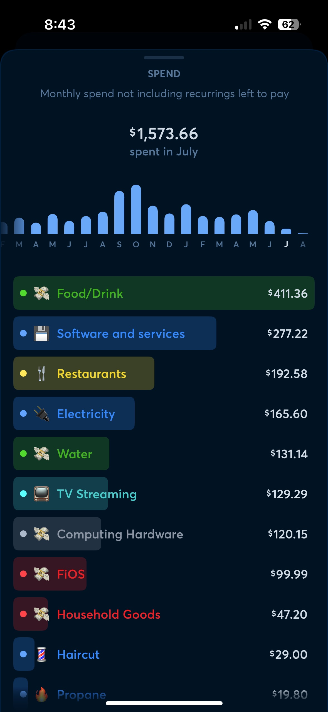

Although [I moved into my new apartment on June 1](https://kctofel.com/n/articles/2025-mid-year-update/), that month was a transition for me. There were still bills for the house to be paid, for example. July is a different story because we closed on the home sale early in the month.

My wife and I used part of the proceeds to pay off my step-daughter's undergrad student loans. We also paid off the Tesla, which has been signed over to me.

I'm effectively debt free now and there were still enough proceeds to provide each of us roughly $100,000. More on what I did with my share later.

For now, let's start with my monthly budget for apartment living, and how I did in July in terms of spending.

# Living Expenses

Being a minimalist, I had budgeted for just under $2,000 to get through July. This figure includes all of my bills, food, and enough spending money to enjoy myself. 

I lumped my spending on groceries, liquor for at home, and items bought for my break at work into the "Food/Drink" category. All other categories are singular.

Note that there were still a few left-over bills from the house. The FiOS expense is one and FiOS is included with my apartment, so going forward that expense disappears. 

And the Electricity spending was actually for both the house and the apartment during my transition. I anticipate that figure to drop by 60 to 75 percent going foward.

I also had to renew some services / subscriptions in my name only; going forward that spending will be much less.

To sum it up, I did really well, spending $1,573 on budgeted items. My takehome pay from Wawa totaled $1,872 in July. So I was in the green, right? Not exactly.

# A key exclusion

Since my apartment rent is $1,525 a month and I knew I was only taking home less than $2,000 a month from my part-time job, I excluded rent from my budget. 

In other words, I know I'm going to overspend by $1,525 each month even if I stick to my budget exactly. But I don't control my rent as it's a fixed cost.

So I'm focusing hard on my budgeted expenses with a goal of spending less than I plan. Until I can change my income, it's better for me to focus on what I can control, financially. 

As a result, I did "lose" money. However, I lost less than if I had overspent on budgeted items, if that makes sense.

# Using the house proceeds to make more money

Back to that $100,000 I got from the house sale. After much thought, I parked it in a Wealthfront Cash account, currently paying a 4% APR.

You can [get your own Wealthfront Cash account here](https://www.wealthfront.com/c/affiliates/invited/AFFA-LI6D-EOWH-5TW5), and for three months, we'll each get a 0.5% APR boost.

That money is liquid as I can transfer money to my local bank account in minutes. I can also have Wealthfront send checks to pay bills at no cost. 

And because the money is actually held at Green Dot Bank (where it's FDIC insured), the account has both a routing and account number. I've already set up some auto pay bills with it.

Best of all is the interest. Assuming the rate doesn't change and I don't draw down too much, the money will earn roughly $4,000 over the course of a year. I know the rate will eventually come down but since I don't know when, my estimate is for the current rate.

That effectively adds $333 to my monthly income for now, further stemming the loss of any budget shortfalls and rent. I'm still in the red each month, but it's a little less.

# My strategy

Assuming nothing changes with my income, I'll continue to aggressively stick to my budget plans going forward. And I'm leaving as much of my liquid assets in the Wealthfront Cash account to earn as much as possible. Yes, I'll be taxed on that income but that's another story for another day.

I'm effectively keeping the bare minimum of cash in my local bank account while my money with Wealthfront makes me more money. I'm also doing what I've done for the past 10 years: Earning cash back on nearly all purchases.

Any purchase I can make with my Apple Card, for example, I do. That earns me 2% back on every purchase. And it lets me maximize the interest earning cash with Wealthfront. When the Apple Card bill is due, I pay it in full, so I don't pay any interest. This lets me earn 2% on the day to day purchases and earn 4% on the money I'm not using until my credit card bill is due. 

Note that my wife and I employed this strategy for years. In 2024, for example, we earned $797 in cash back from Apple withoug paying a dime in interest. You can do the math, but suffice it to say, we used that card a *lot* in 2024 to earn that much back.

# What have I learned?

July was a very informative month. I really thought I'd be spending at least $700 in a month to eat. Nope, not even close.

Part of the reason? I drive 3 minutes to the grocery store on a near-daily basis, buying only what I need for that day. Occasionally, I'll buy something that will last a few days, but generally, I'm buying a meal or two at a time.

By doing that, I have very little food in the house. However, I found that I actually wasted very little food. The only food item I threw out was four hot dog rolls. That's it! No other food waste, which is not only a huge savings but a more responsible way to live too. I'm literally putting one 13-gallon trash bag out weekly so far at the apartment. 

I'd say I learned that I don't need much to be happy but I already knew that. July just confirmed it. 

I ate well, and ate enough. I got out for some drinks and pub food a few times. I have all of the services I need -- internet, streaming, etc... -- to keep me entertained.

In short, I'm continuing to enjoy my mininmalistic lifestyle. Moreso perhaps because it's just me, meaning Amazon isn't coming to the house multiple times a week like it used to.

# One last expense not captured

I actually lost about $1,000 more from my cash flow last month. 

After several weeks of deep thought, I made the intentional decision to buy a used Fujifilm X-S10 camera and two lenses. This was around $1,200 of unplanned, unbudgeted spending. There won't be much of that going forward but it's worth noting.

I don't regret the purchase at all even though it completely blows my budget.I wanted to get back into photography and give myself another reason to get out of the apartment.

I've already used the camera on a near-daily basis and even took a 4 mile photo walk this past weekend; something I wouldn't have likely done without the camera.

I particularly like this still, which uses the camera's black and white film simulation mode:

Again there won't be many big, unplanned / unbudgeted purchases like that going forward. I'm considering a travel vacation in September but there's no way to save up for it at this point. And I could use the break, so we'll see if I pull the trigger on that.
