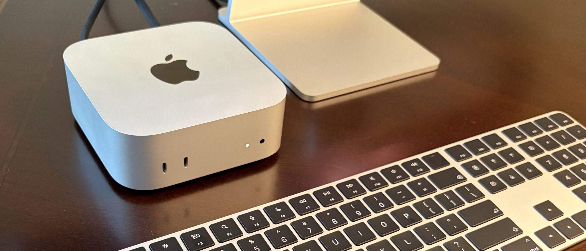

# [Apple Mac mini (Late 2026) Review: Strong performance, but losing its grip on value | Tom's Hardware](https://www.tomshardware.com/desktops/mini-pcs/apple-mac-mini-late-2026-review)

*Published: September 21, 2026*

The Apple Mac mini (Late 2026) offers strong performance improvements, particularly in single and multi-threaded tasks, thanks to its new M6 processor and enhanced storage capabilities. However, the recent price increase to $899 has raised concerns about its value, especially as memory and storage upgrades have also become more expensive. While the design remains compact and functional, potential buyers should be aware of the lack of USB-A ports and the absence of upgrade options post-purchase.
