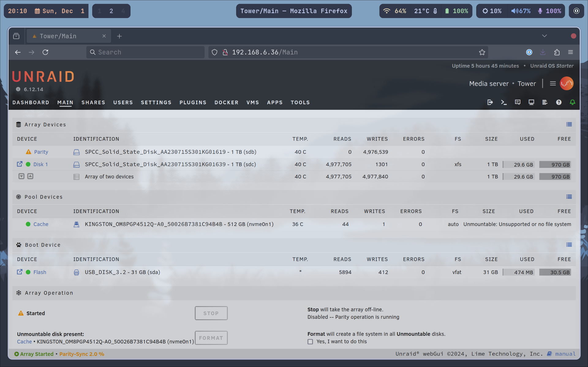

## December 1, 2024

Futzed with creating an [UNRAID](https://unraid.net/) boot disk on my 32 USB Flash Drive several times. System wouldn't boot from the disk. I was using the [UNRAID install creation tool](https://unraid.net/getting-started) for these failed attempts.

Decided to download the [.ZIP file from the UNRAID releases page](https://docs.unraid.net/unraid-os/download_list/), which has to be modified into .iso format. [AnyToIso](https://crystalidea.com/anytoiso) is a Windows app to do just that.

Once I had the .iso file, I downloaded and used [Rufus](https://rufus.ie/en/) to create the boot disk, which worked. It's a handy tool, similar to Balena Etcher.

Setting up parity in my two disk array is expected to take 13 hours, so I won't be able to use UNRAID until tomorrow. First goal is get SearchXNG up and running again.

--- 

We went to IKEA this afternoon while my sporting events were recorded on YouTube TV. Didn't buy anything. The luster of IKEA seems to have dimmed now that we're older. Maybe it's because most of what they sell is great for the "dorm" and "apartment" audience?

---

I only had time to watch the Liverpool v. Manchester City match after coming home. Great to see the lads win at home, 2-0! ManCity is now 11 points behind, while Arsenal is trailing us by 8.

---

Watched two outstanding videos today:
- [A historical look at the Vetrex console from 1982](https://youtu.be/UlRyE4ru1S8?si=UeBtdAckPVQ5efad). I never got a chance to see or try one back in the day. #VideoGames
- [15 Stoic life lessons I wish I knew at 20](https://youtu.be/n2W1jeimTtg?si=pBAqxpulpei5tav0). Ryan Holiday shares his stoic wisdom yet again and I can relate to all of the topics. I learned them only a few years ago and I'm still challenged to put them into practice on a daily basis. #Stoicism
