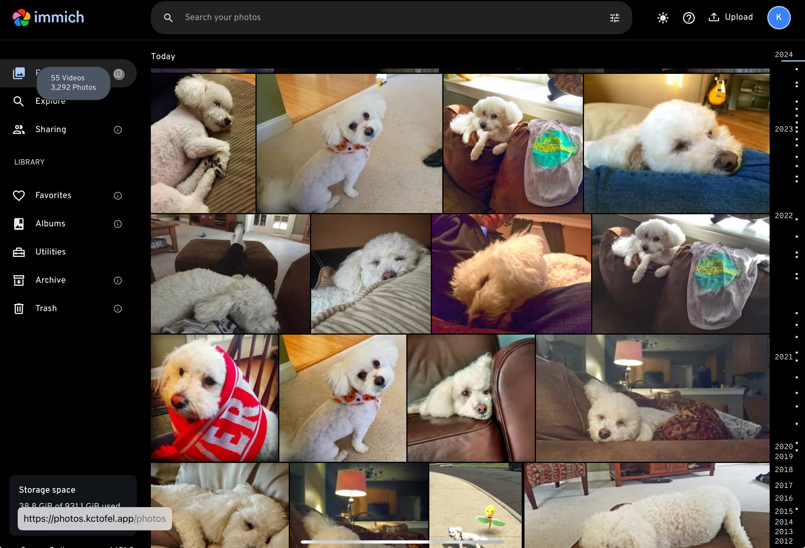

## December 3, 2024

After getting Wallabag as a web-clipping / read it later app on the home server yesterday, I used this positive momentum to install [[Software/Immich]] on the mini PC. Immich is a self-hosted, private app that replicates much of the Google Photos experience. Of course, Google doesn't get any of the data from your photos with Immich. 

The application has some great features, including facial recognition, support for photo places, albums, sharing and more. There's a mobile app to sync local photos from your phone to the server as well. I used the app to sync more than 2,000 images and videos from my iPhone to the homelab server and it all went without a hitch.

