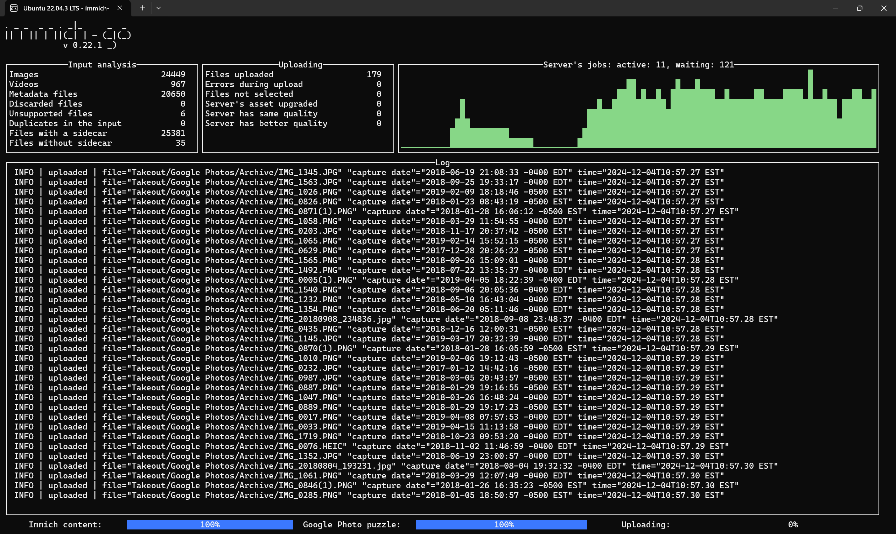

## December 4, 2024

After pulling in all of the images and videos from my iPhone to the self-hosted [[Immich]] service, today Google Photos becomes the focus. 

I downloaded 26 .zip files from Google Takeout (each at 2 GB) to get my photos and videos locally. Then I used [this handy script](https://github.com/simulot/immich-go/tree/0.22.1) to import them all over my local network to Immich. The process is still going but no major hiccups so far.

