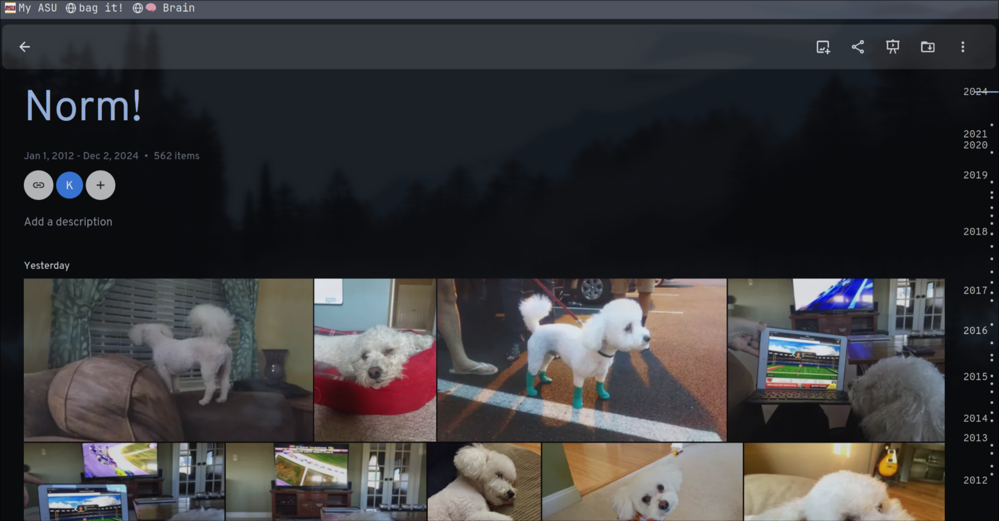

## December 4, 2024

After pulling in all of the images and videos from my iPhone to the self-hosted [[Immich]] service, today Google Photos becomes the focus. 

I downloaded 26 .zip files from Google Takeout (each at 2 GB) to get my photos and videos locally. Then I used [this handy script](https://github.com/simulot/immich-go/tree/0.22.1) to import them all over my local network to Immich. The process is still going but no major hiccups so far.

---

It took about an hour for the script to import all of my Google Photos to the homelab server but it worked without a hitch. 

Even the Google Photos albums I had previously created carried over without any noticeable issues.

I tested the creation of a publicly shareable link to this album and it's working perfectly.

---

Forgot to watch the afternoon Liverpool at Newcastle match so I caught it before bed on a replay. Newcastle played a much better first half, completely shutting down the LFC midfielders. I was suprised it was only 1-0, Newcastle at the half. And then the second half adjustments were made.

Within 5 minutes, Liverpool broke a press and saw Curtis Jones bag a goal, thanks to a sweet assist from Salah. Hard to belive that this was Jones' 150th appearance for the club. Has it been that long? 12 minutes after that, Newcastle nabbed another one. Slot wasted no time and made a triple substitution. And then it became the Mo Salah show: A goal at the 68th minute from a Trent pass in front of the net, followed by a snap goal at the 83rd minute.

In the 90th though, Kelleher made a poor decision to let a set piece kick go over his head; Newcastle snuck one in for the tie. I hate to see us drop 2 points but I have to give Newcastle credit for playing so well against us.

---

Some interesting videos I watched:

- [A reaction to seeing Queen at Live Aid for the first time](https://youtu.be/SEwxkbkyzmw?si=N8a4xaO9iwg1o-Q3) Queen's 1985 Live Aid set at Wembley Stadium is one of the best (if not **the** best) live performances ever. I remember it back in the day. David Bowie went on after Queen and their set was so good, he commented to them that they would be impossible to follow after it. So it's always interesting to see someone today watch that performance for the first time ever. This YouTuber was brought to tears, as I often am when re-watching Freddie Mercury play a crowd of nearly 100,000 people like a finely tuned instrument. You might be too.

- [Remembering Eddie Van Halen](https://youtu.be/g2NLnXhTzTo?si=vkd1BlmSe4B7fyUu) Since I was going down a musical memory lane, this interview with Alex Van Halen about his brother's life and untimely death was a good watch. Poignant and insightful on the Van Halen brothers, and on handling the loss of loved ones.
