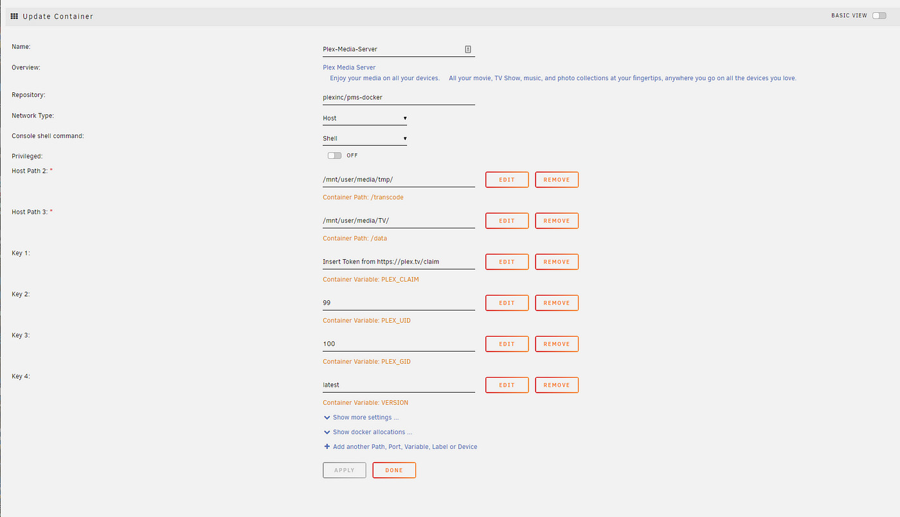

## December 5, 2024

On one hand, I’d think more consumers would want self-hosted services / data on their own server running FOSS.

On the other hand, having used some of the available server software, I can see why “mere mortals” can’t do this, or get try to do it and get overwhelmed.

Guess the current solution is a pre-built NAS with proprietary software atop Linux? But is that the *best* solution on the market? Is there room for better options that don’t require a computer science degree? 🤔

