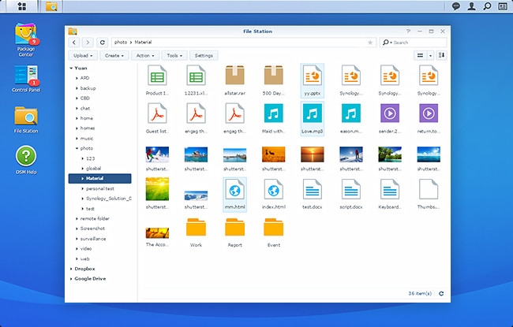

## December 5, 2024

On one hand, I’d think more consumers would want self-hosted services / data on their own server running FOSS.

On the other hand, having used some of the available server software, I can see why “mere mortals” can’t do this, or get try to do it and get overwhelmed.

Guess the current solution is a pre-built NAS with proprietary software atop Linux? But is that the *best* solution on the market? Is there room for better options that don’t require a computer science degree? 🤔

---

I need a way to easily send notes from my phone to this site. I'm sure some open source options exist. Could always code something up using Node.js to add notes to an "inbox" in this Github repo for later usage.

---

Tyler came over for dinner as he usually does once per week. I got him interested in "[The Last Kingdom](https://www.imdb.com/title/tt4179452/)" on Netflix a few weeks ago, so we watched two episodes of season one tonight. I read [the book series](https://www.bernardcornwell.net/series/the-last-kingdom-series/) before catching the videos and they were a fanstastic read. This Netflix Original is done really well though. So much so, I've sat through all five seasons at least 3 times prior. 

Highly recommended if you're interested in how England was formed through the combination of various kingdoms, while fighting off the Vikings from Daneland at the same time.
