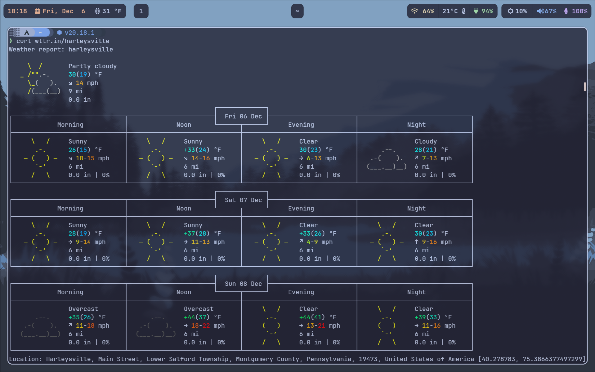

## December 6, 2024

How did I not know about [Wttr](https://wttr.in), a command line weather app? To get local weather, it's just a simple 

```bash
curl wttr.in
```



In the above example, I followed the server name with a slash and my town name. Easy to alias for simple usage too. I do have (and use) a weather widget in the top left bar of Hyprland, which has worked well. But it's always nice to have a simple command line option for current and future weather since I'm in a terminal most of the time.

---

Decided to get out of the house and still tackle my Asteriods assignment in Python. Headed to Starbucks and two hours later, got the final version working. 

Today I added:
- Collision detection between bullets and any asteroids
- Splitting large asteroids into two smaller ones with more velocity and in two random vectors
- Removing any asteroid hit by a bullet

This block of time was challenging. The collision detection was relatively easy since I already had a function for this. I simply had to use it with any bullets and asteroids. I was already using it for detecting a player collision with any asteroid. The harder part was removing any asteriods hit by a bullet (and removing the bullet too from the display) and spawning two smaller asteroids. In the end this was time well spent.


