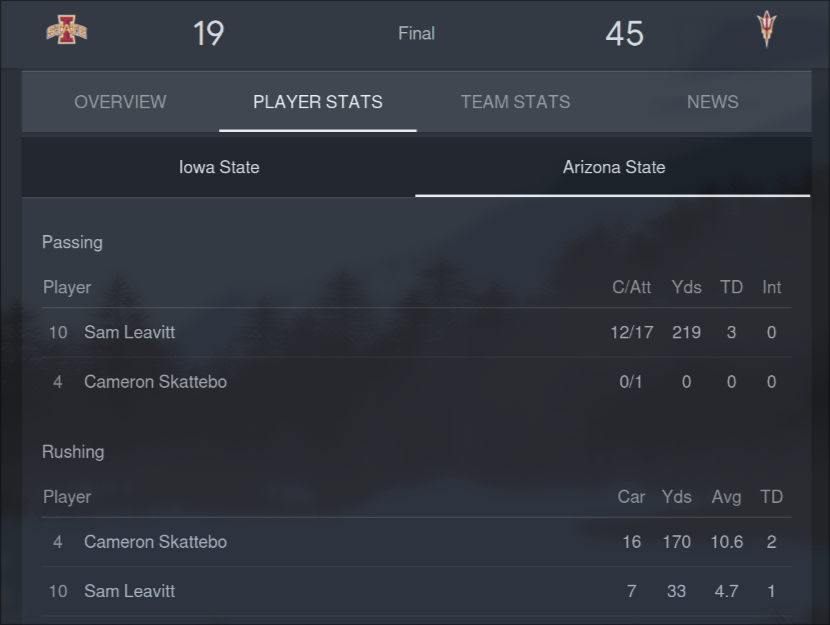

## December 7, 2024

After two weeks off, I went back [to work](https://myconscious.stream/blog/Working-at-Wawa/) today. I wasn't scheduled but I was asked to cover a co-worker's shift and I said yes. As much as I enjoyed the last two weeks, and got so much done during it, I enjoyed being back.

It was great to see my co-workers and our regular customers. The day wasn't stressful and I had more than enough time to get my work done. I also walked 6.93 miles during the shift, which is about average. I was tired near the shift end though, having not done much activity for 14 days.

Long story short: It's good to be back and I'm set for 32 hours on the schedule for the next two weeks.

---

After work, I settled in the recliner and watched my Sun Devils football team tackle Iowa State for the Big12 Championship. It was very much back and forth for the first quarter, which had me concerned. But then ASU roared to life and quickly turned a 10-10 football game into a 38-10 score. Credit three turnovers caused and a stellar running back in Cam Skattebo for that.

They were picked dead last out of 16 teams in the conference. And they won the title in their very first year within the conference. On to to the College Football Playoffs, next. We'll find out tomorrow who and where they play.

---

An interesting video I watched:

- [Moore's Law is Dead — Welcome to Light Speed Computers](https://youtu.be/wBqfzj6CEzI?si=ucs0Wq_A8ZGgOmax) It's becoming clear that traditional silicon chip architecture is just about maximized. We're running into physical boundaries where electronic circuits are simply too small to be further optimized. Now I'm not saying that light, or rather, photonics, is the answer. But this video look at a photonics computing startup offers a compelling argument. It seems like most of our current computing bottleneck is more in the circuit paths between chips rather than in the chips themselves. Using light for these interconnects can virtually eliminate latency in this area.

---

With the workshift from 6am to 2pm, followed by the ASU game, I really didn't have much time or desire to do any tech work today.

I still have to submit my final Asteroids project repo for my class. I want to clean it up a bit first but that's on the docket for tomorrow. I also plan to write my week in review blog post. And what a week it was, looking back at the daily journal!