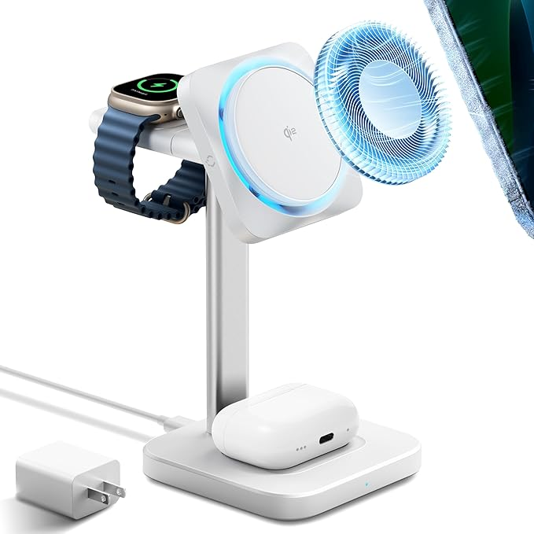

## December 8, 2024

Given that it's a Sunday, I'm keeping it low-key and relaxing today. My only goal for today was to publish my weekly review blog post, which [I did](https://myconscious.stream/blog/Week-in-review-Dec-8-2024/) by noon.

This was the first blog post where I had a full week of daily journal entries to use as content. What a huge help! Plus there's the added bonus of actually journaling each day. My journal is probably less like most people's because I don't document many personal feelings or thoughts. It's mostly about my daily activities, which tend to be tech-centric.

---

The first ever 12-team College Football Championship brackets debuted today. Thrilled to see my Sun Devils getting the number 4 seed, giving them a bye in the first round. The boys are off until the New Year's weekend where they play either Clemson or Texas in the Peach Bowl.

---

The wireless charging stand I bought for my iPhone, AirPods and Apple Watch broke a few weeks ago. Heard good things about [this option from ESR](https://www.amazon.com/dp/B0D7YR2ZDG?ref=ppx_yo2ov_dt_b_fed_asin_title&th=1) because it has some type of cooling mechanism. That, and the Qi2, support should make for fast charging. Worth a try for around $60. More to follow after it arrives tomorrow.

