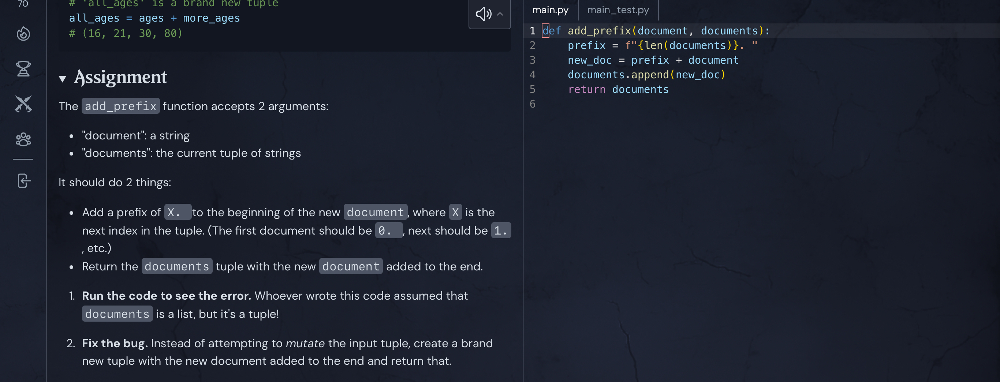

## December 12, 2024

Day off today but I squandered the morning. Bad habit. Hoping to get some work done before having to run out at 1pm or so.

___

Having the devil of a time with the Functional Programming (FP) course at Boot.dev I started up this afternoon. But it's not about the concept of FP; it's an assigment that illustrates the concept. 

Code is given that returns an error because it attempts to modify a tuple, and tuples are immutable. I get that. 

But trying to create a new tuple with some manipulated data isn't working for me just yet. Taking a break!
