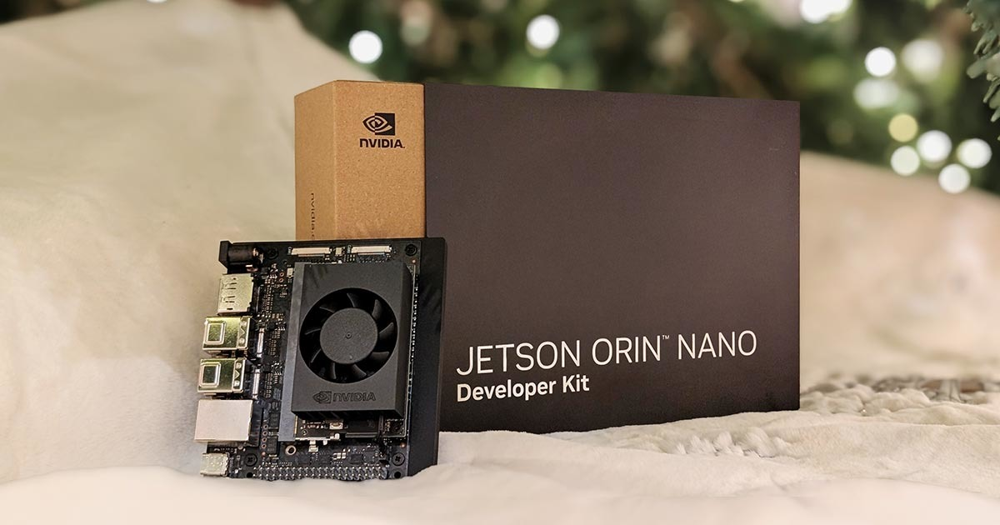

## December 24, 2024

Worked a 6am to 2pm shift today on the register and it was **much** busier than I had expected. Lots of last minute gift card purchases. I'm sure I sold another $1,500 in Wawa gift cards today. Off tomorrow and then working the next three days in a row.

---

Speaiing of tomorrow, which is Christmas, we're planning to spend most of the day with Sydney and X at the hospital. Nothing has changed with the early baby situation although every day the baby isn't delivered, the better the odds for a perfectly healthy newborn.

---

I was beat after work and napped so no tech work or tinkering today. No reading either, although I still have time to pick up Volume 1 of the Harvard Classics tonight. I've thoroughly enjoyed reading Benjamin Franklin's autobiography so far. 

---

I watched this great [hands on video of the new $249 Nvidia Jetson Orin Nano Super](https://youtu.be/QHBr8hekCzg?si=SK6-gT6279FKt9mX) and I wonder if there's a place for this low-powered AI-centric hardware in my homelab. 

Currently, I run Ollama in Linux for any AI projects but... the only device powerful enough to do so is my Lenovo gaming laptop with its Nvidia RTX 4060 mobile GPU. For $249, [the Nvidia solution](https://www.nvidia.com/en-us/autonomous-machines/embedded-systems/jetson-orin/nano-super-developer-kit/) could be accessed from my homelab for any AI apps or projects at any time. 🤔

A Raspberry Pi could work for this but it would only generate about one token per second. The Jetson returns around 21 tokens per second, which is more than fast enough for tinkering. 

There are downsides though: With only 8 GB of memory, I'd likely be limited to models with around 2B parameters. I have more RAM in the Lenovo (both dedicated and VRAM). Still for the kinds of projects I'd do, this limitation would be acceptable. And the Jetson runs on 15W of power. The RTX 4060 in my Lenovo laptop can use up to 100W of power by itself, not including the rest of the components.
