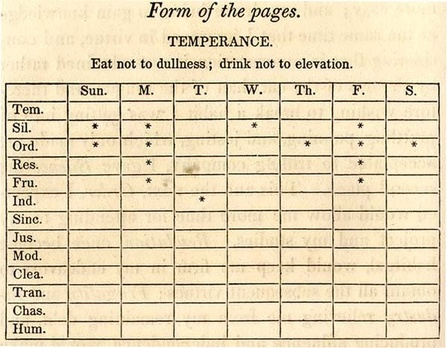
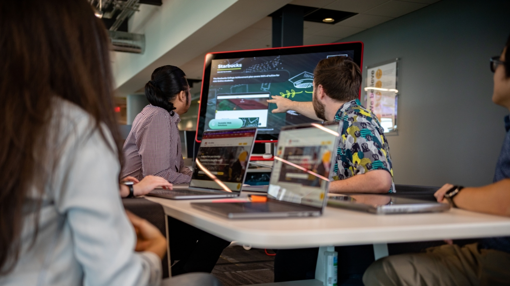

## December 25, 2024

Althoug I didn't update yesterday's journal after 7pm or so, I did spend another 1.5 hours reading Franklin's Autobigraphy. Very enjoyable and interesting how he planned his days with far more rigidity that most of us do today. 

My approach of timeboxing tasks and activities on my calendar does fit nicely here. I'll continue to do this throughout 2025 as it has served me well... when I pracitice it faithfully, that is.

Some of his writing inspired me to look deeper into his life. I shouldn't be surprised to learn that Franklin was a Freemason. I've long considered presenting myself to this organization as, based on what little I know about it, fits nicely with my own beliefs and virtues, i.e.; honesty, integrity, helping others in need, etc.. I am not aware that any of my contacts or acquaintances are Masons, so I'll have to keep an eye out.

In a related thought, [Franklin devised 13 virtues](https://fs.blog/the-thirteen-virtues/) that I readily identify with. Interesingly he created his own written "habit tracker" type of journal to track when he deviated from these. 

---

Spent Christmas with Tyler, Sydney and X in the hospital, sharing gifts and eating some non-hospital food. Hopefully, we gave them a little time off from thinking about the baby, which is now at 32 weeks. The plan is to try and make it to 34 weeks and then decide the next step. 

---

Found an open position that practically has my name on it. It's an [online education success coach](https://asu.wd1.myworkdayjobs.com/en-US/ASUStaffCareers/job/EdPlus-Success-Coach_JR100037)... at Arizona State University. The pay is decent enough but of course, it's not a remote position. Need to think on it and discuss the idea with the family because moving from Pennsylvania isn't something Barb necessarily wants to do. And I would certain miss seeing Tyler every week as I do now.

It does appear to be a great place to work based on [this video of the school's EdPlus department](https://www.youtube.com/watch?v=_q-HhRrmIvA).

---

### Amazing videos I watched today:

Don't ask why but I was on a personal flight vehicle kick today. 

[Flying to In-N-Out on my paramotor](https://youtu.be/mBXAGUE91hg?si=bf5gfE0p993HFnIm) Not only does this guy fly himself over the Arizona desert to a burger joint, but he EATS his meal while flying home! It would be neat to try one of these vehicles as they're not crazy expensive (you can get a decent one for around five grand). But I'd never have a meal up in the air.

[Flying around on my human drone](https://youtu.be/gOSt8Q2PvWM?si=0tx21IvbZ1RWhYWm) Another wild video with an impressive electric-powered drone for transportation. Unfortunately, this one will set you back around $50k. Still, I'm impressed with these early personal flying machines. 

[Flying an eVTOL for the first time](https://youtu.be/ZVL2yYYFW7Y?si=QbPQJkCUFrtA0lhA) Now we're entering into semi-practical toys for the rich because this thing will cost you around $125k. But again, it's incredible to watch personal transportation above the ground. Would love to get in one of these although I'd probably want one of my own (even though I can't afford it, don't think it's practical and don't live in an area I could readily use it.)
