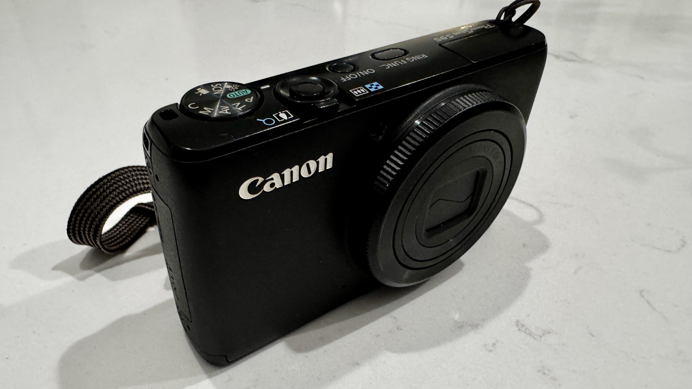

## January 15, 2025

Early 5am to 1pm shift today for the third workday in a row. Was really tired after work so I ended up taking a nap until dinner. Still sticking to my new diet strategy, even at work. Hopefully, I've lost another pound or so this week but too soon to tell. I'll weigh in over the weekend.

---

I watched a few videos about the recent resurgance of old "digicams", aka: digital cameras. One of the more sought after cameras is the Canon S95, now selling for around $200. Crazy for a 10 MP camera! 

I remembered that I bought one new in 2012 and sure enough I still have it. I dug it out and it's in near mint condition. I also have two batteries and a charger for it, plus a 32 GB microSD card with adapter that I threw in.

I'll carry it around for a bit to re-learn how it works and to see if it can replace my smartphone camera in case I move to an e-paper phone in the future.

---

No tech work today even though I had good intentions. Tomorrow I have to meet up with a friend for morning coffee but after that... some class work and coding.
