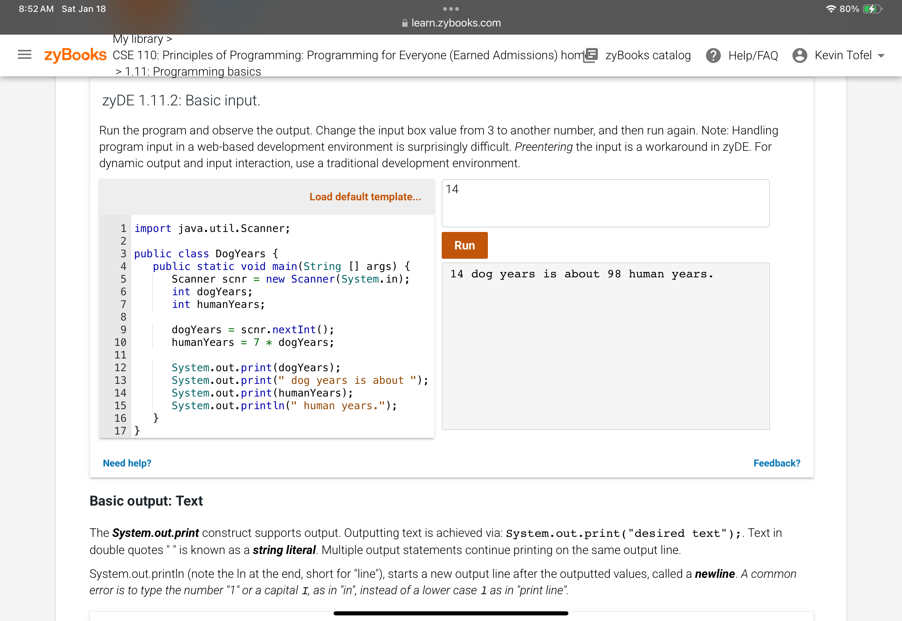
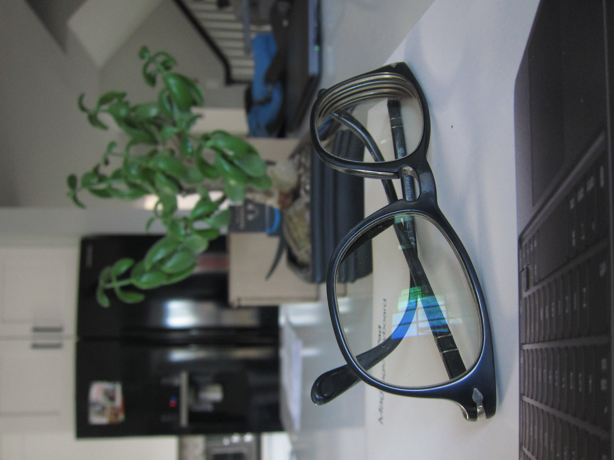

## January 18, 2025

A few days off from journaling as I've been slogging through a 40 hour workweek. Thankfully, I was able to spend 2 hours working through the first part of my programming course at ASU last night.

---

The course format is interesting because of the interactive textbook. It works for reading, of course, as well as so much more. There are many participation activities, which are like mini quizzes, for example. And all of the Java coding is done within the textbook as well. 

Here's an example of some pre-provided code that you can compile and run directly in the browser through the book.

I'm about 75% through the first chapter so another hour or so today should wrap that up. I have until January 27 to get through the first two chapters and assignments.

---

I've been playing a little more with the Canon S95 lately and captured a few indoor shots that came out reasonably good.

