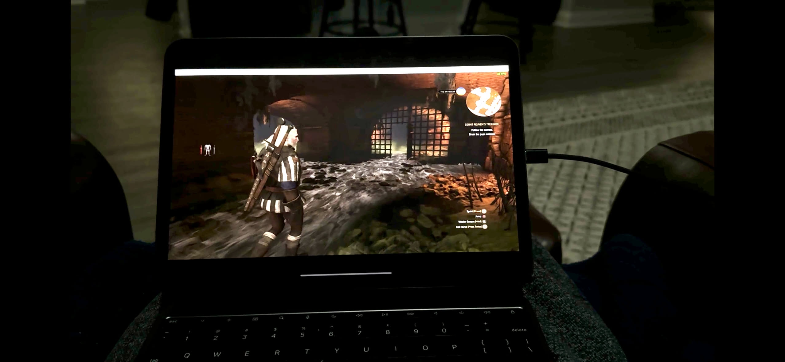

## January 21, 2025

No work today after an 8am to 4pm shift yesterday. I watched a smidge of the Presential Inaugeration coverage but I'm going to approach these next four years differently than before. I'm not going to tune in to see what the President is saying. Instead, I'll focus on what he's doing. 

That means frequently visitin the WhiteHouse.gov site, which already has around 20 executive orders, and perusing major news headlines. 

---

It's noon and I've already spent nearly 1.5 hours on my ASU classwork, taking notes for my second brain in a Java folder. Today was focused on data types, type casting, expressions and variables. Simple stuff.

---

Last night I tinkered with [Moonlight](https://moonlight-stream.org/), a way to stream PC games from my gaming laptop to my new iPad Pro 11. It's not perfect although the latency is relatively low on my home network. The bigger issue is properly configuring the iOS Moonlight client to match the resolution of my gaming monitor. 

I also have a new wireless Xbox controller arriving today so I can use Bluetooth to connect it directly to my iPad for gaming. I do have a wired controller but I want to keep the USB port on the iPad open for charging. This should accomplish that setup goal. In essence, I'll hopefully use the iPad Pro and controller as a larger, higher resolution Steam Deck.
