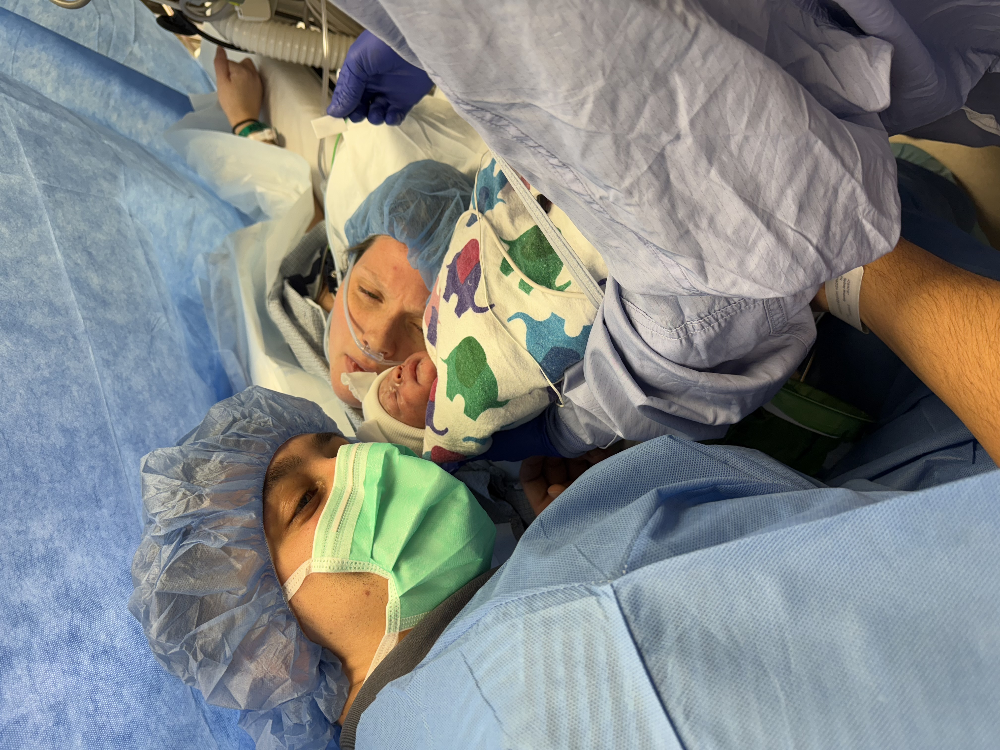

## January 4, 2025

No journaling for the past two days. Did I work 8 hour shifts those days? Yup. I don't like this pattern.

---

Baby Melani was born last night just before 6pm. She weighs 3 pounds, 13 ounces and will be in the NIC unit for at least a few weeks.

So far she and her mom are both healthy. I think this is the best outcome given that Sydney was in the hospital for roughly 3 weeks to this point. She's definitely going stir crazy. Thankfully, she'll be able to come home in 48 to 72 hours. She won't be able to drive for several weeks but at least she'll be comfortable.

---

I was effectively accused of stealing at work yesterday, which isn't true. I don't need to document the details for later revisiting because the accusation was false. 

I understand why the situation was raised and I have no issue with anyone doing their job to determine what really happened. However, there's a way to ask questions without sounding like an accusation and without stating "You didn't pay for that." More research could have been done and, in my opinion, should have been done.

With limited information though, my character and integrity were wrongfully questioned. I'm disappointed.

---

Thanks to MyFitnesPal, I've logged all of my meals and snacks for 8 days now. It's a challenge to keep under the roughly 1,800 daily calorie limit but I'm managing. I'm drinking less coffee and only drinking water after that. I did manage a few days of exercise on the treadmill for 30 minutes this past week. Going to weigh myself tomorrow morning to see what difference this has made but not expecting much just yet.
