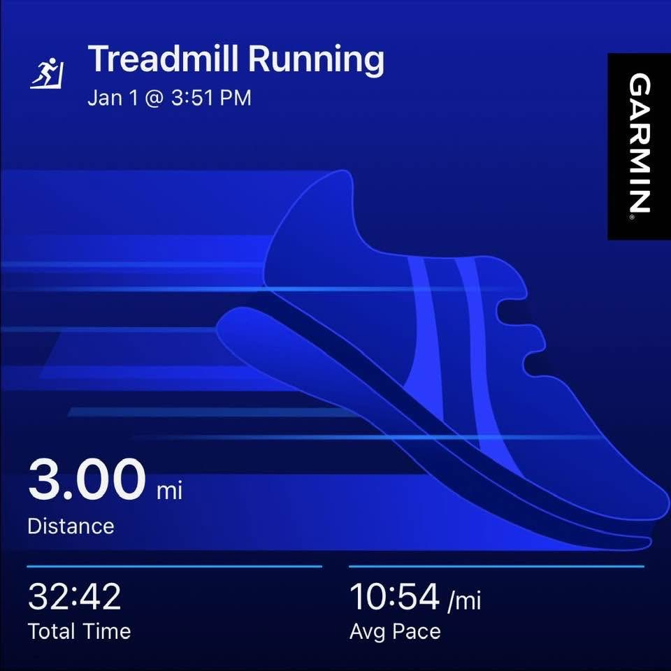
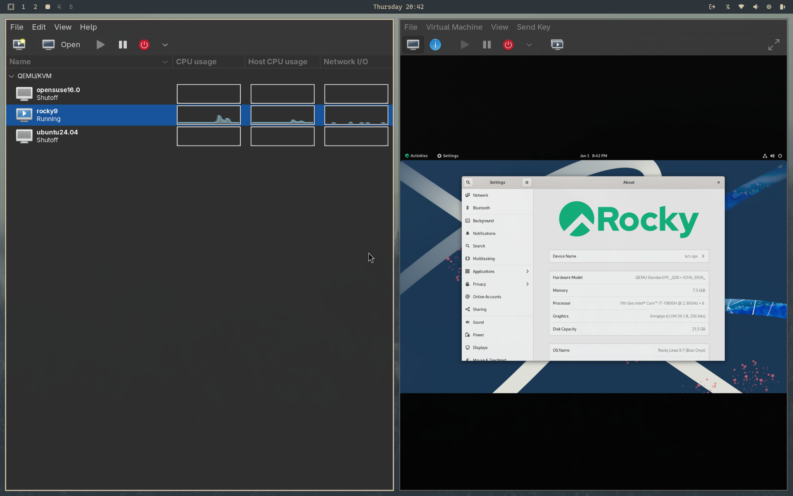

## January 1, 2026

A relatively quiet day at work, as expected after New Year's Eve. It was extremely quiet until around 8am when people started to wake up. 

Even then, the overall customer traffic didn't build up to become too busy and I think I only walked around 7,500 steps during the shift, which is a little low.

---

After work, a quick lunch and a 90 minute nap to rest up. After that: My first visit to Planet Fitness after joining yesterday. 

For $15, it's basically a steal, even though I only plan to use the treadmills. I drove over around 3:45pm and most of the equipment was available, with just a few folks running or weight training.

I decided to take it easy and run 3 miles at an 11 minute pace to kick off the new year.

My plan is to hit PF on the days I don't strength train, so I took today off from my Speediance workout. I'll hit the lower body workout tomorrow on the Speediance and aim to run the following day.

---

I had plans to start my 2026 reading list today but there's no time left in the day. 

Tomorrow, I'll start "The Obstacle is the Way", mainly because it's the only book on my reading list that I already own. 

If I have time tomorrow after work, I'll hit up the local bookstore and pick up another title from my list.

---

Over the last day or so, I did set up testing environments for my Linux+ Certification training.

I'm using Qemu and virt-manager on my Arch Linux laptop. So far, I have three distinct Linux distros installed: Ubuntu, Rocky Linux and OpenSUSE, each with a different desktop environment. 

I may not even need those as the terminal will likely be my main interface. But I thought it would be nice to learn a little about various DEs as I study for the Linux+ cert.

---

During some downtime, I watched the first three episodes of "Star Trek: Discovery", season 3. I've seen these before but really appreciate the long-term story arc over the first three seasons.

I also watched a few useful or interesting videos:

- [The 19 best Linux resources](https://youtu.be/Jllnhid7O7w?si=MLFCLScw5H5NXUfm)
- [The Beatles, You've Got to Hide your love away in 4K](https://youtu.be/ZJyVl9x53Kc?si=mKrNPy0Zo-JFgYhH)
- [If you want to make 2026 your best year ever, follow these 6 simple Stoic rules](https://youtu.be/IZ1RqjTpnn4?si=iExwD6zug1Q6XQGm)
