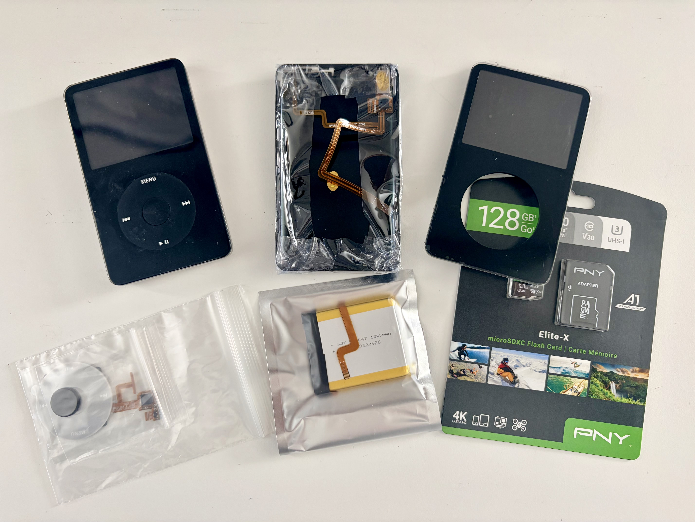

## January 4, 2026

After finishing a 4 week program on the Speediance machine, today was a good day to re-take the strength assessment. My last one was the day the machine arrived, back on November 26, 2025. 

All of the assessment results were positive and I created [a tracking table](https://kctofel.com/n/goals/strength/strength-assessment/) to view progress over time. My plan is to take the assessments every 6 to 8 weeks.

Since I did the assessments and haven't yet picked a new program for strength training, I decided to hit the treadmill this afternoon. Felt really good and cranked out 5 miles at a 10:25 pace. I'll be happier when that number starts with a 9 though.

--- 

Had some free time to start reading the first book on [my 2026 reading list](https://kctofel.com/n/articles/2026-planning/#wisdom): "The Obstacle is the Way". I've owned this for a few years and have browsed it, but never read it cover to cover.

Only 20 pages in but this stood out to me:

> It takes skill and discipline to bat away the pests of bad perceptions, to separate reliable signals from deceptive ones, to filter out prejudice, expectation and fear. But it's worth it, for what's left is **truth**.

--- 

I finally received the final part needed to modernize my iPod Classic: a four port, microSD iFlash board that will replace the old spinning hard drive. 

My plan is to crack open the iPod tomorrow and swap out the old parts for the new ones. Those include a new gray click wheel, a 1200 mAh battery, front and back cover, and the iFlash board to massively increase the storage capacity.

--- 

Made a deliberate change today to watch news from a foreign country rather than the US-based media. An hour of BBC News was very enlightening on the US - Venezuela situation. 

Back on December 14, I watched [this interesting and related video regarding Venezuela's massive oil reserves and the type of oil it is](https://youtu.be/Pgwny1BiCYk?si=Nr_dGLaNiEFTamLm); heavy crude. This might explain quite a bit of the current situation.

