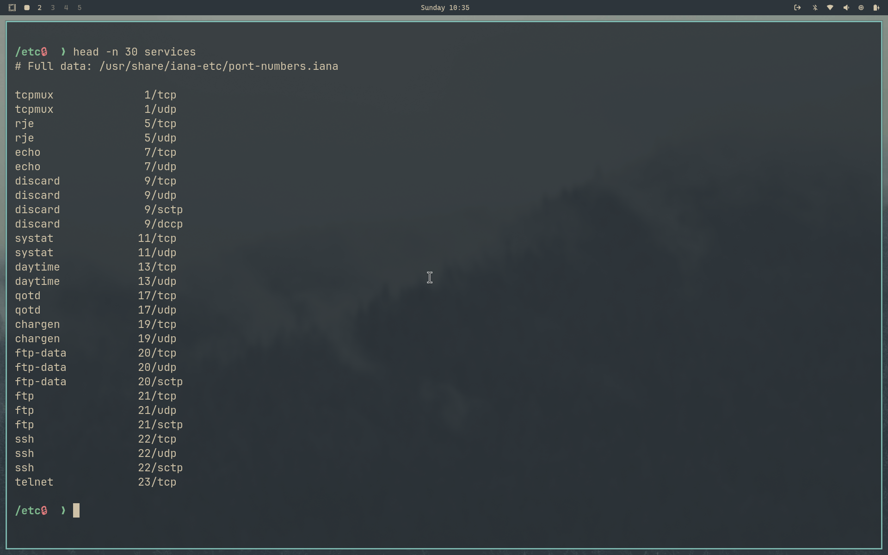

Both Linux servers and desktops run on the same kernel, shells, etc... Desktops provide graphical desktop user interface for ease of use. Servers can offer this but are generally used through the terminal (or more access) and primarily operate without user interaction.

Services are server programs that provide shared resources to one or more clients, typically available all the time.

## Launching Services

Background processes that run constantly and listen for requests
Spawned processes that are started by a "parent" program or process listening for requests

## Daemons

These are the constantly running background processes. Their program names typically end with the letter ***d*** to indicate they're a daemon process. 

Examples:
- mysqld is the mySQL daemon
- sshd is the ssh daemon
- crond is the job scheduler for cron job
- inetd is the internet daemon, which is a super-server: it listens for different requests and launches the service relevant to the request.

## Network protocols and ports to route requests to Daemons

|Port|Protocol|Description|
|:---:|:---|---|
|20, 21|FTP|File Transfer Protocol|
|22|SSH|Secure Shell protocol for sending encrypted data to a server|
|23|Telnet|Unsecure protocol to interacting with a server shell|
|25|SMTP|Simple Mail Transport Protocol|
|53|DNS|Domain Naming System to match IP addresses to computer names|
|67|DHCP|Dynamic Host Configuration Protocol|Provides valid IP addresses on a network|
|80|HTTP|Hypertext Transfer Protocol|Allows clients to request web pages from servers|
|109, 110|POP|Post Office Protocol|
|137, 138|SMB|Server Message Block protocol for Microsoft servers to share files and printers|
|143, 220|IMAP|Internet Message Access Protocol provides advanced mailbox services for clients|
|389|LDAP|Lightweight Directory Access Protocol provides access to directory services to authenticate users, workstations and other network devices|
|443|HTTPS|A secure, encrypted connection to web servers|
|2049|NFS|Network File System provides file sharing between Unix and Linux systems|

All ports for Linux services are defined in ***/etc/services*** 

