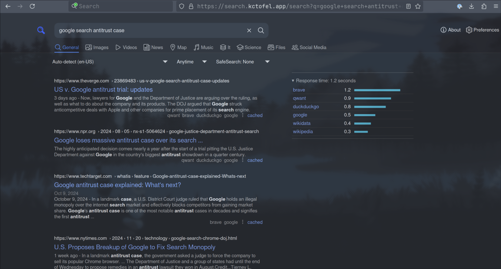

## What is SearXNG?

Rather than use a search engine directly from big tech, SearXNG is a meta-search server that reqests search results from nearly 50 search engines.

This elminates big tech from creating a personal profile on your search results. Additionally, it returns consolidated search results without any advertisements.

[Project docs and source code](https://docs.searxng.org/).

